# 信贷风控实践：信贷模型的开发流程优化与实践总结

信贷风控，即用户信用风险管理，是通过预测用户的信用风险来支持贷款决策，优化资金分配并降低违约风险的过程。这个过程的核心是对借款人未来还款能力和意愿的不确定性进行量化和控制。传统的风控方法依赖于个人财务状况、经济环境和就业稳定性等宏观因素，但在数据驱动的时代，我们主要通过分析用户的行为数据来揭示其信用状况，从而更有效地管理风险。

在信贷模型的构建过程中，我们不仅要面对外部的严格要求和业务的复杂性，还要确保模型的准确性和稳定性，因为轻微的疏忽也可能导致巨大的资金损失，并威胁到业务的安全。因此，深入分析模型构建的每一个环节，避免细节问题引起的风险累积，对保障业务的长期稳定至关重要。

虽然传统信贷风控模型已有数十年历史并积累了诸多模式与概念，但在现代数据科学的发展下，部分传统做法已不再适用。在多个信贷模型开发过程中，我们从基础原理出发，对传统风控建模流程进行了创新性的探索和优化，并逐步落地为流程和工具，广泛应用到了多个业务场景，提高了模型效果和建模效率。本文将分享这一过程的阶段性总结，涵盖从样本设计到特征构建、特征筛选、模型优化，直至上线后的监控等全方位内容，以供对信贷风控建模感兴趣的同学参考和提出建议。

注：全文较长，可以根据目录选择感兴趣的部分结合图表阅读

[TOC]

## 样本设计

信贷风控模型的样本需要尽量贴近业务目标去设计，才能保证训练出来的模型在目标场景下有最好的效果。对于大多数用户风险预测类模型，模型的目标都是**基于现有用户数据，去预测在未来用户是否会违约**。对这个目标进行细化，我们就可以得到我们样本选取的标准。

### 特征观察期

因为是基于现有用户数据来预测，而用户数据往往由用户在几个月到几年内的一系列行为表现构成，我们有必要考虑到底需要回溯观察用户多长时间的行为。在传统信贷风控领域，往往会基于现有数据的情况，结合业务场景依靠专家经验来确定一个固定的观察期，通常在 6 到 36 个月之间。观察期过短或过长都会有负面影响，这里总结如下：

| 观察期长度 | 影响                                                                             |
| ---------- | -------------------------------------------------------------------------------- |
| 过短       | 数据表现不稳定，丢失一些需要一定时间才能体现的 pattern                           |
| 过长       | 可能会纳入陈旧失效信息，增加维护成本；实际业务中，很多数据也无法支持过长的观察期 |

在大数据场景下，特征表现期的概念被弱化，我们可以根据业务情况先确定一个较长的观察期，然后在观察期内进行不同长度窗口特征聚合，让模型来帮助确定不同特征最适合的一个或者多个观察周期。

### 样本表现期 - 加入动态表现期

因为目标是预测未来用户的表现，这个未来距今的时间需要进一步的量化。理想情况下，在逾期风险预测场景中，我们是希望知道在尽量远的未来，用户的逾期表现的。因为从业务角度看，只要用户最终会全部还清，收益总是正向的。但是实际上，我们并不能选取过长的样本表现期，并且表现期过长也会带来模型效果的降低，这里总结如下：

| 表现期长度 | 影响                                                                                                                                                                                     |
| :--------- | ---------------------------------------------------------------------------------------------------------------------------------------------------------------------------------------- |
| 过短       | 用户表现不稳定，风险未充分暴露。 尚未逾期用户可能在更长时间段上会变成逾期，已逾期用户在更长时间上可能会恢复为未逾期。而用户表现不稳定会导致模型学习到错误的 pattern，或者难以学习。 |
| 过长       | 1. 逾期数据回收减少，样本不足； 2. 样本时间距离现在过早，导致样本环境与线上环境不一致，影响模型效果； 3. 样本时间点到表现时间过长，影响用户行为因素过多，模型预测困难；        |

对于新上线的业务，由于缺乏用户逾期数据，通常表现期时间都比较短，需要结合业务情况和数据情况拟定。对于已经成熟运行的业务，在传统信贷风控领域可以借助 vintage 分析来确定，找到客群逾期风险表现稳定的账龄，通常贷前预测的表现期为 6 到 24 月，贷中和贷后预测的表现期为 3 到 12 月。

需要注意的是，客群逾期风险的稳定期与信贷产品的形态关系很大，对于新兴互联网金融业务，表现期可以有更灵活的设计。我们可以基于业务情况，设计多种动态的表现期，例如不再是观察一个时间点，而是观察用户未来一段时间范围内的表现，来平衡样本表现期过长和过短带来的问题。

相关的判断流程可以总结如下

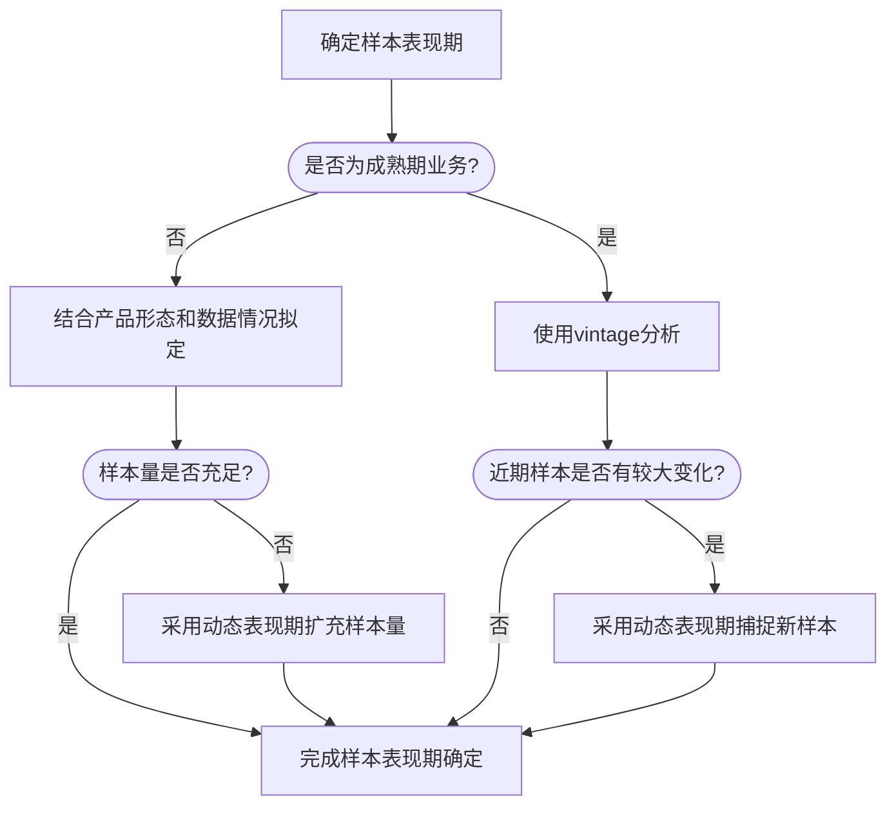

在过往实践中，通过引入动态表现期，在早期样本量不充足时，能够为业务带来 5%~10%的效果增益；在成熟期近期样本变化较大（例如新放量）时，能够为业务带来 2%~5%的效果增益。

### 样本观察点的选取 - 单观察点到多观察点

用户的过去和未来在模型的样本中都是一个相对的概念，而两者的分界线就是我们的样本观察点。模型在业务应用中，在每月，每天，或者每次请求中，都会对用户未来是否逾期进行预测。这个预测的时间点就对应于样本中的观察点。在传统信贷风控领域，通常只会做到月级别的推理，反馈到样本上就是会选取某月的月终日作为样本观察点，然后按照确定好的特征观察期和样本表现期，分别去获取我们模型训练需要的特征数据集和预测 label。

通过效果对比可以发现，相比于传统的选择单一的日期作为样本观察点，选择多个日期作为观察点在大多数场景下效果会更好。对于按月推理的模型来说，可能会是连续的数个月份，将各个月份中包含的样本聚合在一起作为总体样本。这样的做法在贷前场景下可以理解为将多月的用户的申请请求进行聚合，在贷中场景下可以理解为将多个时间点的用户状态时间切片作为样本进行聚合。这样有很多好处，最直观的好处就是样本会大幅度增加，因为聚合了多个时间点的用户表现。另一个好处是可以让模型学到更充分的特征分布，平滑时间相关的波动，增强模型稳定性。因为实际模型上线后都会使用多月，如果只选取一个观察点或者单一月份的数据，有的业务特征可能在观察点时刻有较大波动，或者刚好遇上特定的历史放量批次，甚至经济社会环境周期，可能会造成模型线上效果与离线数据集上的效果产生较大的偏差。

当然使用多个日期作为观察点时，也需要注意一点，如果引发了同一个用户的样本重入，可能会破坏数据的 i.i.d (独立同分布) 性质。这一点的影响可以通过引入适当的采样方式来缓解，避免样本中的单用户重入次数过多。在模型评估时也需要给予符合真实线上数据分布的样本来评估，而非存在样本重入的样本，确保样本量和稳定性的增加能够给模型效果带来更大的增益。另外在现金贷等产品形态的业务中，除了时间切片外，也可以考虑以用户支用时点作为观察点，这也是多观察点样本的另一种形态。

这里将两种方式的优势和局限性对比如下：

| 观察点数量 | 优势                                     | 局限性                                                                                     |
| ---------- | ---------------------------------------- | ------------------------------------------------------------------------------------------ |
| 单观察点   | 简单易于实现； 样本完全遵守独立性   | 容易受单点因素影响； 业务早中期样本量过少难以训练                                     |
| 多观察点   | 样本更加稳定； 能召回更多的违约样本 | 会一定程度上降低样本独立性，需要通过采样缓解； 设计更加复杂，需要结合实验确定具体方案 |

在过往实践中，业务早中期样本量较少时，多重观察点能够给业务带来 5%到 10%的效果增益。

### 用户 label 的好坏定义 - 关注样本量

我们希望模型可以预测用户是否逾期。那么逾期在样本中具体定义是什么呢？首先肯定不是用户处于逾期状态就算做样本中的逾期，因为很可能只是用户短时间遗忘了，这部分用户并不是我们想排除的。理想情况下，我们希望找到所有永久逾期的用户，在实际操作中，我们只需要找到从逾期到非逾期状态的转化率足够低的用户即可。

在成熟的业务中，我们通常会通过用户滚动率分析或者资金滚动率分析去确定逾期用户的判定的时间。例如经过用户滚动率分析，逾期 30 天以上的人，有 25%在半年后会变为非逾期用户，而逾期 60 天以上的人，仅有 5%在半年后会变为非逾期用户，我们可以认为逾期超过 60 天是一个较好的逾期用户定义，或者通俗的说，已经足够“坏”了。

对于逾期数据回收较少的早中期业务，可以基于贷后的催收策略来协助 label 定义。例如催收策略在 30 天是一个催收手段强弱的分水岭，那么就可以选取逾期大于 30 天 (30+) 作为逾期 label 的要求。这里要特别注意区分是大于 30 天还是大于等于 30 天，需要与催收策略口径保持一致，否则在分界线节点前后的用户逾期率可能会有较大的差别，造成模型 label 的好坏程度不符合预期。

对于逾期数据非常稀缺的早期的业务，样本量则是第一考量。例如当发现 30+逾期口径回收的逾期样本量过少，例如小于 1000 条，而 7+逾期口径的样本量达到了 5000 条，通常优先选择样本量更大的口径。因为当样本量过小（例如小于 1000 条时），会导致模型的效果严重下降，效果评估也会有产生较大误差。在这样的情况下，好坏程度的稳定带来的效果增益通常都远小于样本量带来的效果增益。

当确定好样本中的逾期天数要求后，对于逾期天数大于 0 但是小于逾期天数要求的用户，我们会直接排除在样本外。模糊的 label 定义会让模型难以学习到正确的分类 pattern，给模型带来错误的残差优化方向。注意 label 的清晰定义和提供更难以分辨的样本是两件完全不同的事情。label 的清晰定义是基础前提，在此之上给模型提供更难以分辨的样本，才能够帮助模型更好的学习到分类的边界。

结合表现期可以发现，逾期天数还有一层选择是取表现期末的状态值 (end)，还是取表现期中出现过的最大值(ever)。这个需要结合业务目标，滚动率，样本量几个方面来综合判断。首先是业务目标，例如希望尽量控制风险，就可以取表现期中的最大值，如果更关注用户近期的信贷表现，可以取表现期末的状态值。如果逾期天数对应的滚动率较低，例如选取的 7+逾期，那么期末的状态会更能体现用户的信用水平。另外随着逾期口径的天数要求提升，选取期末和期中的影响实际上会减少（因为滚动率提升之后高天数逾期的用户大概率也会在期末逾期）。在业务早中期，样本量也是一大影响因素，如果选取 ever 口径可以显著召回更多的样本，可以优先考虑使用 ever 口径。

这里可以将主要流程总结为下图

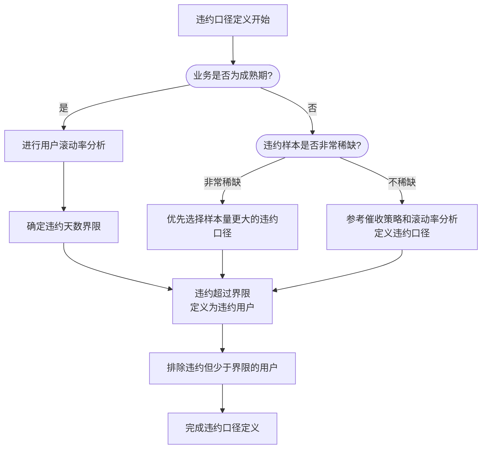

### 样本设置的参数确定方法 - 实验与分析的结合

在样本设计的过程中，我们常常会遇到很多种样本设置的选择。从数据出发，定义好贴近线上真实数据分布的验证集，然后对样本观察点，样本采样设计，样本好坏比例等多种因素进行实验对比，可以帮助我们去确定最佳的样本参数。在效果相近的样本设置方法中，可以尽量选择更加朴素的方法来避免过拟合风险。

另外在信贷风控开发中，由于时间是贯穿样本始终的要素，要特别注意防范数据穿越带来的风险。例如同一个逾期用户在训练集已经逾期，在跨时间测试集中再次出现，通常会让模型很容易对这个用户进行预测，可以考虑剔除测试集中与训练集相同的用户再查看效果，避免高估模型性能。

但要注意样本定义中 label 定义相关的一些参数是难以通过实验确定的。例如好坏定义（逾期天数，end or ever) 和表现期长度，在大多数情况下你是无法通过交叉实验来确定最佳的 label 定义的。因为和测试集的 label 定义最一致的训练集，效果在对应的测试集上几乎总是最好的。这种情况下，我们更多的是参考前述的一些数据分析手段，例如 vintage 分析和滚动率分析，结合数据情况 (充足 or 短缺) 和业务目标 (严控风险 or 宽松风险)，与模型应用方进行沟通，确定出最适合业务当前情况的 label 设计。

这里将样本设计的参数定义方法总结如下

| 主要确定方法 | 相关参数                                                                   |
| ------------ | -------------------------------------------------------------------------- |
| 业务分析决策 | Label 定义 (y): 逾期天数，end or ever, 表现期长度等                        |
| 实验对比确定 | 数据集相关设置 (X): 样本客群选择，样本采样设计，样本好坏比例，观察点设计等 |

需要额外注意的是，风险控制是一个平衡的艺术。我们在关注风险的同时，也要关注好收益与利润。高收益往往伴随着高风险，而低风险也通常意味着低收益。在业务早期我们通常会更加偏向于把控风险，而在业务成熟期则需要找到更好的平衡点，让整体收益最大化。为了达成这个目标，我们在不同时期也应该设置不同的样本实验方案和样本设计目标，让我们训练出的模型更好的服务于业务。

### 数据集划分 - 多时间分区

除了样本口径的设计，还有一个很重要的样本设置是样本的挑选与数据集的划分。

在挑选样本用户前，需要负责放量策略的同学沟通，了解各个放量批次的情况，避免样本仅包含了特定实验批次或者特定放量人群，导致模型对各种好坏模式学习不充分。在数据允许的情况下，尽量包含多个月份的样本，便于后续样本划分和稳定性测试。

除了实验和放量批次外，也需要分析业务关注的目标客群，确保选取与业务需求相同的目标客群进行建模。

对选取的样本，可以首先划分用于最终评估的测试集，以及整体训练集。注意在训练全流程中不要基于测试集对模型设置做任何调整，避免出现信息泄露高估模型效果。

对于整体训练集，建议包含多日或者多月的数据，便于后面进行特征稳定性筛选，也可以避免遇到特定月份异常分布导致模型效果异常。

在训练集中可以根据样本量大小，来确定验证集的划分方案：数据量足够的时候，验证集可以在整体训练集中进行划分。如果数据量很充裕，也可以考虑再额外划分一个验证测试集，用于测试在验证集上进行多次参数选择后的效果，缓解验证集信息泄露的问题。在数据量很少的时候，可以通过对整体训练集进行交叉验证的方式代替固定划分的验证集，降低过拟合概率。

在信贷建模场景中，最终测试集中，需要至少保留一个跨时间测试集，即与训练集不在一个时间分区的测试集，且尽量包含多个时间分区，避免因为特定月份或者放量批次而误判效果，也可以便于观察模型效果随时间的衰减。

之所以必须保留跨时间测试集，是因为信贷场景的样本回收过慢，用户的好坏定义需要经过特定的表现期长度后才能确定，导致模型建模基于的特征总是几个月甚至一年之前的特征。可以预料到线上环境的特征分布相比建模时必定会产生一定的迁移，从而造成模型效果衰减。如果我们直接对同一时段的测试集进行评估，常常会高估模型效果，且无法体现到提升模型效果稳定性带来的增益。总的来说，对模型在跨时间测试集上的预测能力进行评估，可以营造更接近于实际应用的测试环境，得到更贴近于线上的效果。

如果训练样本较多，也可以在训练集中再随机采样一部分隔离出来作为同时间的最终效果评估集，便于与跨时间效果测试集进行对比，了解模型效果的稳定性和衰减情况。

基于上述流程，我们可以总结数据集划分的流程图如下

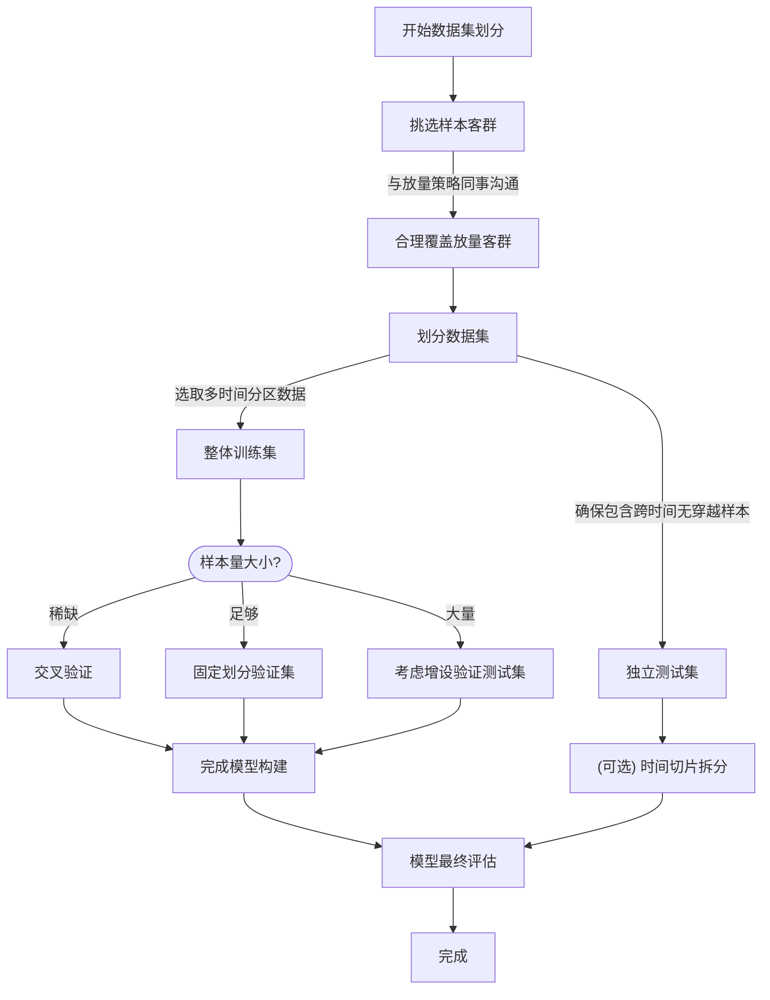

### 小结

在信贷风控模型开发中，样本设计可以说是最重要也是最关键的一步，如果一开始的样本定义有问题，后面的努力都会变得毫无意义。如何让样本能做到更贴近业务诉求，不只是一个技术问题，也是一个沟通问题。不要吝啬在样本设计和样本沟通上花费时间，不然很可能因为一个疏漏导致后面的建模过程功亏一篑。

## 特征体系构建

当定义好样本后，我们可以开始寻找和挖掘特征。特征决定了模型的效果上限。对于一个新的风控业务而言，在历史日志流水数据准备好后，最重要的事情就是基于流水构建特征体系。一个清晰，全面，稳定产出的特征体系，是各类信贷风控模型不断迭代提升的核心基础。

### 特征生产流程设计 - 减少资源，提升效率

传统信贷领域的特征通常是首先从流水按用户聚合到月，然后再从月按照固定时间窗口，例如 6 月，12 月进行聚合和衍生。

我们因为将特征迭代速度提升到日级别，需要对已有的特征生产流程进行优化，目的是保证模型性能的同时，尽量减少计算资源的消耗和产出的耗时。需要注意的时，特征产出的耗时实际上会影响业务中真实的模型效果，尤其是在时效性要求较高的模型，保证特征在凌晨可以产出截止前一日日终的数据，和实际需要在晚上才能产出，甚至需要 T+1 乃至 T+15 才能产出的特征，效果可能会有显著的差距。因此我们要尽量保证特征生产的高效。

那么如何提升特征生产的效率呢，这里根据实践总结了几个要点：

| 提升特征生产效率的方法   | 方法说明                                                                                                                                                   |
| ------------------------ | ---------------------------------------------------------------------------------------------------------------------------------------------------------- |
| 优化数据链路             | 尽量基于明细数据 (dwd) 或轻量日聚合数据(dwm) 进行开发，避免使用更上层的数据，例如宽表字段。因为数据表来源越多，路径越长，产出时间就越慢。                  |
| 开发中间聚合表           | 设置适当的中间聚合表，例如日用户聚合表，可以避免花费长时间去读取行数和列数都很大的原始流水。                                                               |
| 衍生窗口基于更新时间拆分 | 将日级别和月级别特征的衍生时间窗口进行拆分。例如日级别特征只需要聚合近一月数据，长期数据的聚合让月级别更新的特征来关注。，样可以避免对大量历史数据进行聚合 |

在过去的一些开发中，直接对流水数据每日聚合历史多月数据，效率是十分低下的，且需要消耗大量计算资源。一个更可行的方法是将任务进行拆分。首先将当日流水按照用户维度进行聚合，确保主键唯一，将单个用户的多条流水转换为特定条件下的次数，金额等基础统计，形成日聚合表。然后基于日聚合表，对最近 7 天，14 天，28 天进行多窗口聚合。如果是当月 1 日，还需要对上月整月的数据进行一次自然月聚合，然后基于当前以及过往的自然月聚合数据进行多窗口聚合，例如统计用户近 1 月，近 3 月，近 6 月，近 12 月的还款金额笔均值。

之所以做了 28 天聚合之后还需要做自然月聚合，是因为信贷领域中，很多特征会具有自然月上的周期性，例如账单还款，用自然月聚合特征可以更好的对相关特征进行统计，避免出现特征不稳定跳变。

而多月聚合可以帮助我们在更长的周期上去把握用户特征的变化情况，以及找到一些在短期统计中难以发现的 pattern，也会让模型变得更加稳定。最终会同时将日级别的多窗口聚合特征和月级别多窗口聚合特征一起拼接到样本上，供特征筛选和模型训练使用。

由于我们每日只需要统计短期的用户维度数据聚合，因此数据量相对较少，产出效率较高，通常任务时间小于 10 分钟，可以很好的符合日级别推理的需求。而月任务虽然需要统计多月数据，但是每月只需要进行一次，且因为已经提前做好了自然月聚合，因此实际上也等于只是进行了一个短期聚合，任务时间通常小于 30 分钟，在月生命周期中可以忽略不计。经过实验对比，模型使用长短期结合的效果，与直接使用按日聚合多月流水的效果也是一致，甚至更好的。

这里根据过往实践，将传统的特征生产流程和优化后的进行对比：

| 特征生产方式     | 时间窗口          | 更新周期 | 生产时效性           | 资源消耗       | 业务效果对比 |
| ---------------- | ----------------- | -------- | -------------------- | -------------- | ------------ |
| 传统特征生产流程 | 固定 6 月或 12 月 | 月       | 通常需要延期 3~10 天 | 月初高资源占用 | 基线         |
| 新特征生产流程   | 多个时间窗口      | 日       | 通常能在当日上午产出 | 稳定低资源占用 | 提升 5%~10%  |

以及新的特征生产流程如下：

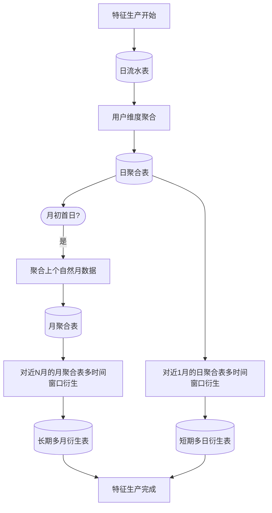

上述产出方式已经固化为了特征产出工具。相比最早的基于 scala spark 的特征衍生工具，这里的特征产出工具并不会直接产出特征，而是通过用户填写的 sql 聚合语句，以及窗口配置，自动化地产出 hive sql 代码，最终在 sql 引擎中执行产出。相比传统的 scala spark 衍生工具，sql 代码的可读性更强，效率更高，且易于维护，可以有效避免特征复杂衍生中可能出现的错误。

### 特征的衍生方式设计 - 避免暴力衍生

特征衍生在这里是指基于多日或者多月的历史聚合数据，设计合理的方式对用户的行为流水数据进行进行聚合。符合业务理解的特征衍生方式能够显著提升模型性能。

常见的特征衍生方式就是基于对一定时间窗口内特定条件下的用户行为的次数，天数，金额，笔均值，日均值进行统计。对于不同时段行为含义不同的特征，我们可以按照早中晚和凌晨进行进一步的分时段统计拆分。

这里的特定条件可以理解为对基础动作在不同场景条件下的拆分。基础有显著业务含义的基础维度拆分可以全部保留，而在做枚举值很多的维度拆分，或者多个维度联合拆分则需要注意筛选，尽量避免遍历式产出特征。可以将制作的特征试跑部分分区，然后去拼接各个目标场景的典型 label。这样可以对各个特征进行覆盖率统计和效果测试，然后在其中保留高覆盖率且有业务含义的维度拆分，或者覆盖率不高但是对目标场景的 label 有显著区分度的维度拆分。在大数据场景下，穷尽各个维度产出特征的方式会导致特征膨胀速度过快，引入大量完全无效或者覆盖率极低的特征，对上层模型的训练和迭代的效率和效果都会产生负面影响。

另一个需要注意的是均值相关的衍生。SQL 自带的均值会忽略 null 项，我们如果关注的是用户在行为过程中的表现，而不关心行为的频率，可以使用缺失值为 null 的 SQL 均值。如果我们更关注用户经过时间平均后的行为表现，需要把缺失值填充为 0 后再取平均。在设计特征时可以根据业务含义选用或者两种同时使用。在底层产出聚合数据时也可以保留 null 项，便于上层灵活进行统计。

对于分场景类别的特征，我们还可以进一步统计其次数或金额在总体中的占比，来了解用户的使用偏好。

对于有明确业务含义或效果区分度的特征，我们可以根据其业务含义，进一步统计行为连续天数，金额分位数，特定金额下的笔数等更加丰富的衍生来多角度刻画用户的行为。

对于多月聚合的特征，我们还可以对不同时间窗口上的日均值，月均值，笔均值等特征，做差值对比，关注用户状态变化。对于波动性有含义的特征，可以进一步补充变异系数等特征来刻画波动。

这里将常见的衍生方式建议汇总如下，其中关于各个场景的定义可以参考特征生产流程设计相关内容。

| 场景         | 常见衍生方式                                                                                                                                                                                          | 特征保留建议                                                                                                                                                                                |
| ------------ | ----------------------------------------------------------------------------------------------------------------------------------------------------------------------------------------------------- | ------------------------------------------------------------------------------------------------------------------------------------------------------------------------------------------- |
| 单日聚合     | 基于业务场景，行为类型，时段等维度，聚合金额次数                                                                                                                                                      | 1. 显著与预测目标相关的业务含义 2 . 清晰业务含义 + 高覆盖率 3. 在目标场景上具有高区分度                                                                                           |
| 单月聚合     | 次数，天数，金额，笔均值，日均值                                                                                                                                                                      | 同上                                                                                                                                                                                        |
| 短期多日衍生 | 1. 基础统计：次数，天数，金额 2. 均值统计：笔均值，日均值 3. 极值统计：最大或最小次数金额 4. 占比统计：金额次数占比 5. 波动统计：变异系数，方差                                   | 根据特征含义选用合理的衍生方式，避免产出不合理，不稳定，或高度冗余的特征，造成后续特征池膨胀过快，特征筛选困难                                                                              |
| 长期多月衍生 | 在与短期日衍生类似的衍生方式基础上，额外增加 1. 多月均值：多种月统计值的取 null 平均或取 0 平均 2. 多月极值：多种月统计值的 max 或 min 3. 多月变化趋势：均值变化，占比变化，变异系数等 | 1. 设计平均值时，缺失值取 null 还是取 0 会对带来不同的统计含义，需要根据特征业务含义确定。 2. 统计极值时，需要注意极值的方向性设计，尽量避免因为无意义的极值统计而引入不稳定特征  |

注意这里只是列举了一些常见针对行为类特征的衍生设计，而实际的场景由于业务复杂性，会有更多更丰富的衍生设计。对于具体的数据我们需要具体分析，结合统计与实验去提升对数据的 insight。

### 特征的更新周期 - 从月到日，再到实时

传统信贷领域通常特征是月级别更新，但这样实际上会丢失月内的信息。而且实际上由于数据生产链路的原因，模型不一定能在月初完成推理，这会导致模型推理的时候基于的用户信息，已经是一个多以前的用户状态了。

在初始额度确定等更多依赖长期信用风险的场景下，这个问题可以得到缓解。但是在贷中交易风控等对时效性要求很高的场景下，丢失一个多月的信息会直接造成业务坏账率的显著提升，因为你甚至会丢失掉用户半个月前已经逾期的重要信息。

也正是考虑到这一点，从信用模型最初版本开始，我们就采用了日更的特征，对模型进行日级别推理，以捕捉最近 n 天的用户行为信息，进过实验对比，相比月更模型带来了显著的效果提升。迭代到后期，我们进一步引入了订单级别的实时模型，来捕捉小时级到分钟级的信息以及交易上下文特征，进一步提升风控效果。

需要注意的时，提升特征时效性能够提升效果的前提，在于在应用的业务场景上，短期或者实时能够获得的用户数据，是能够有效帮助模型去预测的。例如假如模型的预测目标是开通一年后用户是否逾期，增加开通前小时级别的特征对这个预测目标的帮助很可能微乎其微，这种情况下光靠特征的时效性可能是难以提升模型效果的，需要考虑别的路径。

这里基于过往实践总结了相关模型场景的时效性推荐，通常如果低于最佳时效性，业务效果会有显著损失(>5%)，而在最佳时效性之上再提升，业务效果收益会很小 (<1%)：

| 模型应用场景     | 基础时效性要求 | 最佳时效性建议 |
| ---------------- | -------------- | -------------- |
| 用户准入名单     | 月更新         | 日更新         |
| 初始定额定价     | 月更新         | 日更新         |
| 贷中调额调价     | 月更新         | 日更新         |
| 贷中异常交易拦截 | 日更新         | 实时           |
| 贷后催收         | 日更新         | 日更新         |

### 特征的校验

对于新业务的特征挖掘，要特别注意对基础数据进行正确性校验。

校验可以分两类，一类是与业务含义无关的校验。例如保证处理的数据分区存在且行数>0, 做多窗口聚合时，需要保证聚合涉及到的各个分区均有数据。这个情况在长时间窗口回溯的聚合中很容易发生，如果缺乏相关的校验，会导致聚合的特征出现很大的偏差。

另一类是与业务含义相关的校验，这一类需要对业务有更深的了解，但是也对保证特征的正确性至关重要，而且可能在模型构建中也难以被发现。例如同一用户不同类目拆分后的加和统计是否与总量一致，业务含义非负的特征中是否出现了负数，单调递增的特征值是否突然减少等。这类问题通常涉及到流水清洗的环节，可能是上游流水漏报，也可能是下游处理逻辑有问题，通常经过一段时间的校验排查相关问题就会逐渐收敛，逐渐打磨出一套稳定可用的基础数据。

这里将两类校验总结如下：

| 校验类型     | 例子                               | 主要作用                                         |
| ------------ | ---------------------------------- | ------------------------------------------------ |
| 通用校验     | 行数>0, 空分区检测，零值空值率检测 | 避免因为数据上报，任务调度等引起的大范围数据偏差 |
| 业务含义校验 | 非负检测，单调检测，加和检查       | 避免因为数据清洗环节逻辑有误带来的数据偏差问题   |

上述两类校验，与业务含义无关的校验已经固化为了 python 工具自动化进行，并应用到了多个业务场景的数据构建中；而业务含义相关的校验由于相对灵活，通常会直接写为 sql 进行例行化部署，便于维护的同事理解和调整。

### 小结

特征决定了模型效果的上限。特征开发工作实际上并不是一个一劳永逸的事情，而是一个需要持续投入的事情。因为随着数据链路的变更和完善，业务场景的拓展，以及风控开发人员对于业务理解的不断加深，总是有持续的特征开发和迭代需求。而特征开发本身，也是在风控场景下提升模型效果最基础也是最关键的步骤，值得投入时间来进行更加细致的分析和研究。

## 特征筛选

完成了特征体系构建后，我们需要基于已有特征进行筛选。特征筛选是建模的关键环节，在金融风控场景特征筛选会更加关键，这里总结主要原因如下：

| 金融风控场景特点               | 对特征筛选的影响                                                                                                             |
| ------------------------------ | ---------------------------------------------------------------------------------------------------------------------------- |
| 小样本场景                     | 在小样本场景下，过多的特征很容易导致模型过拟合效果下降，也会使得模型的训练过程缓慢而困难                                     |
| 样本回收耗时久，模型使用时间长 | 长期使用的模型对稳定性有很高要求，而特征的稳定是模型稳定的重要一环。需要筛选出稳定的特征以保证模型的长期效果                 |
| 要求可解释性                   | 模型入模特征如果过多，会导致难以进行逐个人工解释性排查。缺乏解释性的特征会导致面对 bad case 难以优化，面对客诉和问询难以反馈 |

在传统金融领域，比较经典的流程是会基于 PSI 对特征先进行稳定性筛选 psi，并集合 woe 和 iv 对特征进行单特征效果筛选。然后通常进行共线性消除，再之后有的会直接模型训练，也有的会再做一次 stepwise 筛选再进行模型训练。最后对获取到的特征进行解释性 review，评估定版模型。

传统的金融特征筛选流程：

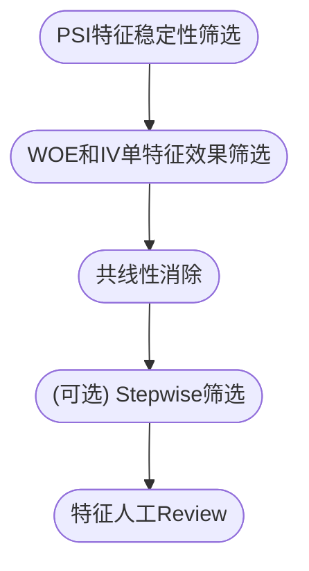

这个流程存在很多问题，首先是 PSI 指标和 IV 指标本身就是不准确的。

PSI 指标存在的问题可以总结如下：

| PSI 指标的缺陷                                    | 带来的影响                                                                |
| ------------------------------------------------- | ------------------------------------------------------------------------- |
| 仅考虑了特征分布变化，未考虑好坏比变化            | 指标不具有完备性，即使 PSI 值很低的特征，也可能导致模型评分异常           |
| 不同分箱数目和分箱方式都会导致 PSI 结果差异巨大   | PSI 指标阈值难以确定                                                      |
| 传统上的 0.1 阈值既不具有解释性，也不具备统计意义 | 采用传统阈值筛选出的特征实际可能过严或漏判                                |
| 无法识别段内 outlier                              | 信贷领域少数 Badcase 也可能导致大量资金损失，这部分不稳定性未在视野范围中 |

详细的分析可以参考我之前写的 [如何构建稳定的金融信贷模型: 特征篇]。

而 IV 指标也有类似的问题：

| IV 指标的缺陷                                               | 带来的影响                                 |
| ----------------------------------------------------------- | ------------------------------------------ |
| 单特征分析，忽略了特征之间的协同效应                        | 会漏掉重要基础特征                         |
| IV 指标依赖于特征分段，不同的分段方式对 IV 指标影响很大     | IV 指标的阈值难以确定                      |
| 传统上的 0.02 或 0.1 阈值只是经验阈值，缺乏解释性和统计意义 | 采用传统阈值筛选出的特征实际可能过严或漏判 |
| IV 指标无法识别段内强特征                                   | 实践中很可能因为分箱方式不同而漏掉重要特征 |

由于上述这两个问题，即使考虑将 psi 和 iv 联合进行筛选，在这一步上也存在着显著的效果损失，且阈值会变得更加难以确定。

另外再本身的特征筛选流程顺序上，对特征一开始进行 filter 虽然能够快速的减少特征数量，但是也会导致模型无法达到最优特征集，从而成为了在特征筛选过程中模型效果降低的主要原因。

基于这些问题，我们提出了新的特征筛选流程，整体流程图示如下：

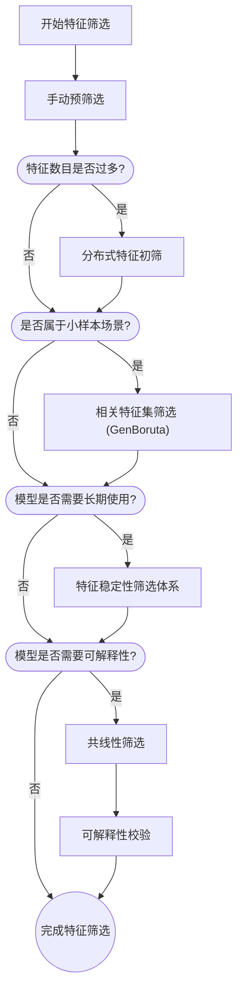

下面我们将对各个重要步骤做一个详细的说明。

### 相关特征集筛选 - 引入 GenBoruta 算法

接着前面的问题，如何能够降低特征数量，并尽量保持模型效果呢？我们在这里引入了**相关特征集**的概念。

相关特征集由与目标变量（label）有关联的特征组成。这种关联可以是正相关、负相关，或者更为复杂的非线性关系。

这里有个关键的概念是**关联**。在实际建模中，特征与目标变量的关联是通过数据驱动的方法来确定，即依赖于模型来识别和提取。然而，模型的选择和训练过程基于最优化理论，它旨在最小化一个特定的损失函数。这意味着模型可能会倾向于选择那些在当前数据集上对损失函数减少贡献最大的特征，而不一定是真实世界中对目标变量有实质影响的特征。尤其在样本数量不足时，而特征数量很多的时候，模型几乎总是会包含大量对目标变量没有实质影响的特征，导致特征入模数量过多并过拟合。而去除掉这些特征不仅不会损失模型效果，由于减少了过拟合，还会在测试集上提升模型效果。

那么如何找出这样的特征呢。 Stoppiglia etc. 在 2003 年首次提出了与随机特征进行比较的方法。即如果一个特征与 label 的关联度弱于随机特征，那么我们可以认为这个特征属于无实质影响的特征。而 Kursa 和 Rudnicki 在 2007 年基于这个想法，进一步加入了迭代和基础的统计检验，并取名为 Boruta 算法，让筛选算法变得更加鲁棒。

这里有一个模糊的概念是对目标变量无实质影响的特征。实际上我们并没有上帝视角，这里对实质影响的定义也是基于数据视角的，可以等同为在这个关联度的评估方法上，无法显著的与随机特征相区分的特征。而这个定义，也是我们基于当前已有的数据集和所选择的关联度评估方法，能对实质性影响程度能做到的最好估计。

需要注意的是，**关联度评估方法**在这里也是一个关键的因素。例如你使用 IV 对特征进行评估，那么这个方法实际上退化为了自动化阈值的单指标 filter 方法。 如果你是使用的逻辑回归（LR)，那么一些本来存在复杂非线性关联的特征可能就会被忽略。而如果你使用的是集成类的模型，例如 XGBoost, LightGBM，那么复杂关联的特征能够得到更好的发现。如果是使用模型来进行关联度评估，可以对模型的效果也进行关注，如果你使用的模型在数据上的效果很差，那么可能是预测目标太难，也可能是模型存在欠拟合，有较多特征关系被忽略。需要留意这一点，因为你使用的筛选模型决定了特征关联度提取的程度和质量。

总的来说，推荐使用与下游特征应用模型一致的模型来进行特征关联性提取，这样可以使得上下游模型对特征关联性提取的能力保持一致，让整个筛选流程获得更好的效果。用于筛选的模型的主要超参数可以尽量与下游保持一致。这样同样可以让筛选器模型与下游特征关联提取性能对齐，避免在特征筛选早期因为模型欠拟合而漏掉有效特征。

另一个重要的概念定义是**显著优于随机特征**。这里面实际上涉及到了三个定义，显著，优于，和随机特征。

首先我们可以关注"**优于**"的定义，即采用什么样的**指标**来比较特征的重要性。在原版 Boruta 算法中，作者通过删除某个特征，然后观察在 Random Forest 上的效果下降，根据效果下降的值来定义特征的重要性。然后对特征重要性进行比较。我们因为采用了 XGBoost 模型作为特征关联提取模型，因此采用了更加稳定的 Total Gain 以及特征 Shap 重要性两种可选方法来作为特征的重要性指标。关于 Shap 重要性可以参考我之前写的 博弈论与机器学习的碰撞 - 探究模型 Shap 值背后的秘密 。

其次我们可以关注**随机特征的定义**。在原版 Boruta 中，是通过将各个原始特征在样本间进行 Shuffle，打乱顺序，来构成的随机特征。这样的好处是可以保持原始特征的分布 (X 分布不变)，只改变了 X 与 y 之间的关系。这样我们可以更加清晰的比对出到底是因为特征变量具有丰富的特征分布，让模型选中了这个特征来过拟合数据，还是因为其 X 与 y 之间存在模型可以稳定识别出的关系，而选中的特征。在 GenBoruta 的初版中，我们加入了更多分布的随机特征，以避免因为已有特征分布过于单一导致模型缺乏分布丰富的随机特征进行对比。但在后期的实际应用中，我们发现对于高维特征筛选场景加入额外随机特征效果可以忽略，因此在更新版本中去除了这个特性。

在更新的 GenBoruta 版本中，我们进一步发现在现代大数据的高维场景下，将所有原始特征都制作一份 Shuffle 来训练，会将原始特征数量翻倍，降低了模型迭代的效率，且实际上很多高维特征分布是相似的，并没有带来额外的随机对比信息。因此在维度过高时，增加了随机选取部分特征进行 Shuffle 的设计，可以在保持筛选效果的同时大幅提升了迭代的效率。

现在定义好了"优于"，也定义好了随机特征，**显著性**还没有得到很好的定义。怎么才能算显著呢？在原版 Boruta 算法中，作者通过多次迭代并结合统计校验的方式定义了显著性。

这里可以把每一次模型训练视作一次二项分布检验，对每个原始特征而言，如果优于随机特征，则记为试验成功，否则记为试验失败。经过 K 次试验后，我们通过统计每个原始特征的试验成功次数和试验总次数，就可以计算出特征好于随机特征的显著性水平。

注意这里由于重复迭代了多次，实际上构成了一个**多重检验**，对于多重检验我们如果希望保持显著性水平，就需要进行校正，否则会很容易犯第一类错误 (错误的否认了零假设)。原版 Boruta 算法采用了 Bonferroni 校正，即简单的将 p 值除以初始特征数目。这样会导致高维迭代时筛选出的特征过少。GenBoruta 吸收了开源版本的原发，首先基于当前待定特征数目进行 FDR 校正，这样可以控制特征中假阳性的比例小于阈值，然后再基于当前迭代次数进行 Bonferroni 校正，这样可以控制迭代出现假阳性的概率小于阈值。结合这两个校正来保证我们最终筛选出的特征实际不显著优于随机特征的比例和概率均小于阈值。

至此，我们完成了对显著优于随机特征的完整定义，相关的改进可以总结如下表

| 改进点             | 原版                       | GenBoruta                      | 改进原因                                   | 效果                               |
| ------------------ | -------------------------- | ------------------------------ | ------------------------------------------ | ---------------------------------- |
| 特征关联度提取方法 | RandomForest               | XGBoost                        | 与下游模型一致可以避免过早欠拟合而损失特征 | 常见场景效果提升 5%~10%            |
| 关联性评估指标     | 模型准确率下降值的 Z-Score | Total Gain/Shap                | 更适合 XGB 模型，且效率更高                | 见上，与提取方法联合               |
| 随机特征的产出     | 全部特征 Shuffle           | 随机选取部分特征 Shuffle       | 大数据场景下提速                           | 高维特征下通常减少 75%以上时间消耗 |
| 显著性定义方式     | 固定参数的 Bonferroni 校正 | FDR+动态参数的 Bonferroni 校正 | 大数据高维特征场景下筛选出特征过少         | 实验高维场景下效果提升 5%左右      |

另一个细节是，Boruta 算法在每一次迭代中，除了会尝试找到显著好于随机的特征外，还会寻找显著差于随机的特征。对于已经显著差于随机的特征，算法会丢除，这样在一轮轮迭代中，模型训练遇到的特征会逐渐减少。这样的迭代设计对于确保最终模型效果是必要的。因为如果特征已经显著差于随机特征，模型基于基于这些特征训练，就依然无法消除这些特征带来的过拟合的影响。当剔除这部分拒绝特征后，模型可以对剩余特征做出更合理的重要性评估，有助于进行更准确的特征关联提取。经过实验对比，如果不进行剔除的话，算法的筛选效果会显著降低。

这里我们可以将 GenBoruta 的算法流程总结为下图

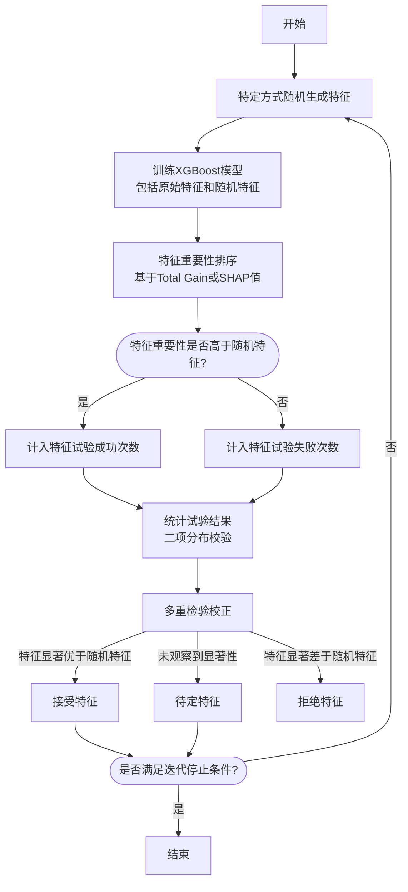

需要注意的是，我们是通过这个方法找到所有与目标变量显著有关联的特征集 (all-relevant set)，而不是一个最小最优的特征集 (minimal-optimal set)。这听起来有一点兜圈子，但事实上由于我们需要对模型的稳定性和解释性进行筛选，我们是无法直接找到理论最小最优特征集的。因为即使我们可以通过某些方式，找到理论最小最优特征集，经过后续的稳定性和解释性筛选，我们常常会进一步丢失特征。由于这时候已经是最小最优特征集了，所以必然会丢失性能。

更务实的做法是先将步骤进行拆分。首先通过 GenBoruta 找到有与目标变量有显著关联特征集，然后再通过稳定性筛选，共线性筛选，解释性筛选，逐步向最小最优特征集逼近。不过也要注意，Boruta 类算法的设计初衷是为了小样本场景下的相关特征集筛选，在样本量很充裕的场景下 (例如数百万样本的场景), 过拟合问题被大大缓解，使用 Boruta 类算法的必要性就大大降低了，直接使用模型筛选即可。我们需要根据样本规模，特征规模合理选择特征筛选方式，来达到性能和效率的平衡。

这里基于常见金融风控场景对业界方案进行了对比

| 特征初筛方案         | 筛选方法种类 | 相比基线特征数量变化 | 相比基线效果变化 | 局限性                                               |
| -------------------- | ------------ | -------------------- | ---------------- | ---------------------------------------------------- |
| XGBoost 模型筛选     | -            | 基线                 | 基线             | 特征数过多，过拟合噪音过多                           |
| GenBoruta            | Wrap-like    | **降低 70~90%**      | **提升**1%~2%    | 主要适用于小样本场景                                 |
| 业界常用金融建模筛选 | Filter       | 降低 5~10%           | 降低 2%~5%       | 忽略了特征协同效应，传统指标存在缺陷容易带来效果下降 |
| RFE 筛选             | Wrap         | 视超参数而定         | 降低 1%~5%       | 关键超参数特征数量难以确定，过拟合风险高             |

我们实现的 GenBoruta 算法工具已经广泛应用到了各个业务的风控模型场景，帮助模型在大幅降低特征数量的情况下，保持甚至提升模型效果，显著优于业界其他已知特征初筛方案。

### 分布式初筛 - 大数据下的优化

对于信贷大数据场景，样本数量可能会很多，特征维度也可能很会高。且与推荐场景的稀疏 ID 类数据集不同，信贷场景的特征主要是稠密的统计特征。面对庞大且稠密的数据集，直接使用 GenBoruta 算法因为涉及到多次迭代，会带来过大的计算量。一个更适合的方式是先通过分布式的集成树类模型进行初筛（单机模型没有足够的内存纳入高维数据），用模型一次筛选出的特征再使用 GenBoruta 模型进行进一步筛选。经过实验对比，在模型超参数合理（主要超参数与下游一致）的情况下，这样几乎不会带来性能损失。

经过实验分析可以发现，集成树模型在超参数设置的比较宽容时，对于绝大多数有效特征都是会有效纳入的，主要的问题在于纳入的特征过多，涵盖了很多无效特征。因此先通过模型进行一次预筛选，并不会使得算法效果显著下降，也是加速 GenBoruta 算法的有效手段。

但是也要注意，效果保持的前提是模型具有合理的超参数。如果用于预筛选的模型超参数过于保守，发生了欠拟合，会导致在预选中就损失部分有效特征，并造成最终模型效果的下降。这个也是需要特别留意的。

### 共线性筛选 - 效果优先

在实际生产中，即使已经对特征进行良好的管理，由于存在多窗口的衍生特征，以及大量口径相似的特征，多重共线性在特征中是广泛存在的。

如果是使用 LR 模型进行建模，需要特别关注共线性的问题。因为共线性会导致 LR 模型的很多统计假设失效，模型参数估计不准，并最终导致模型效果的下降。

如果使用的是类似于 XGBoost 这样的集成树非参方法，从模型效果的角度上是不需要考虑共线性影响的，因为模型的训练并不依赖共线性相关的统计假设。但是我们在金融领域场景中，依然应该关注共线性，并对于高度共线性的特征适当的予以剔除。这主要是出于解释性的考虑，高度相似的特征过多会导致在 bad case 分析的时候难以归因。

这里将不同模型下多重共线性的影响总结如下：

| 模型类别                  | 多重共线性的影响                                         |
| ------------------------- | -------------------------------------------------------- |
| LR 模型                   | 统计假设失效，模型参数估计不准，并最终导致模型效果的下降 |
| 集成树模型 (XGBoost, LGB) | 不影响模型效果，但会影响模型可解释性                     |

因为是基于解释性考虑，所以这里要特别注意共线性筛选对效果的影响，避免因为剔除共线性特征过多而影响效果。一个相对稳妥的做法就是对常见的共线性阈值进行遍历，例如从 0.7 到 0.95, 取 0.05 作为步长。找到剔除特征最多，且在验证集上模型效果下降最少的点。计算共线性所依赖的相关系数推荐使用 pearson，因为 peason 相比其他计算方法例如 spearman 而言相对保守，只考虑了特征间的线性关系，在多数情况下已经可以满足我们对于减少特征增强解释性的需求。

由于共线性本身的计算是基于两两特征之间的相关系数，在具体操作上，我们可以根据相关系数得到每个特征的相关特征组，然后选取其中特征重要性最高的特征作为这个特征组的代表。相比严格的共线性剔除，这是一个更宽松的做法，能够在尽量保证效果的同时适当减少高度相似的特征。

需要额外注意的一点是，共线性筛选尽量后置去完成，例如至少安排在最终的人工解释性 review 之前。因为有的特征虽然可能存在很强的相关性，但是某个特征的稳定性会存在问题，我们可以选择相同共线性的其他更稳定的特征代替，例如更长期的时间窗口统计或者是其他更稳定的业务数据来源。这时候如果提前完成了共线性筛选，只保留了相关特征组中的单个特征，可能会导致本来可以召回的特征信息的缺失。

### 稳定性筛选 - 重新定义稳定性

对于需要长时间回收样本，或者需要模型长期在线上运行的场景，都需要对特征的稳定性进行筛选，避免引入短期效果良好但是在长期上导致模型效果衰减的特征。

金融信贷场景的风险预测，就是一个既需要长时间回收样本，有需要模型在线上长期运行的典型。在风险预测中，用户的好坏定义需要经过特定的表现期长度后才能确定，导致模型建模基于的特征总是几个月甚至一年之前的特征，与线上特征的分布甚至含义相比通常都会有不同程度的迁移。

在模型上线后，由于新样本累积相对缓慢，回收需要时间，同时也要考虑到下游多个策略应用方会依赖模型开发多种风控策略和风控应用，因此模型也不会马上进行迭代，而是会持续运行较长的一段周期。在这段周期内，特征的分布和含义也很可能发生较大的变化，导致模型效果衰减，甚至急剧衰减。因此，如果不注意对特征稳定性进行考量，只考虑在训练集上的效果而将特征入模，很可能导致模型上线后效果不及预期，或者效果持续快速衰减。

反过来，如果能够做到即时回收样本，快速迭代模型，例如在一些推荐场景，是可以不用特别考虑稳定性的问题的。

关于稳定性筛选，传统金融领域核心就依赖于 PSI 指标来对特征进行筛选。我们前面已经讲过了 PSI 指标存在的多种问题，除了难以判断特征分布是否改变外，对特征含义的改变，这个在多数情况下真正影响模型效果的因素，是完全无法覆盖的。这里详细的分析可以参考我之前写的如何构建稳定的金融信贷模型: 特征篇。

基于此，我们提出了一套新的稳定性筛选方案，相关流程图示如下：

下面我们对各个步骤进行说明。

#### 提升特征稳定性的整体流程

经过多次迭代，我们提出了一套能够同时覆盖特征分布改变和含义改变的特征稳定性筛选流程。

要提升稳定性，首先我们需要确定稳定性提升的评估指标和评估方法。

在大多数场景下，提升稳定性的核心目的，实际上为了提升长时间周期上的模型效果，减缓模型效果衰减的速度。基于这个目的，我们可以将**提升跨时间数据集上的模型效果**，作为稳定性提升的目标和评估指标。

我们可以将整体训练集按照时间分区进行拆分，选取较早的多个时间分区作为稳定性评估训练集，较晚的多个时间分区作为稳定性评估跨时间验证集。基于跨时间验证集的多个切片时间效果对比，我们可以获取到模型的随时间的效果曲线变化，从而有机会了解到不同特征对模型在长期预测上的效果影响。

相比之下，如果我们直接对整体训练集进行训练，由于不稳定特征对于部分时间的样本有效果，模型会直接把这部分特征纳入到入模特征中。这样我们就无法了解具体特征对于模型长期预测效果的影响，也就失去了对模型效果稳定性提升的机会。

定义好了评估方法和目标，具体如何将具体特征与模型长期效果联系在一起呢？一个直观的做法就是对特征进行剔除后，重新训练，然后观察模型在不同时间切片下的效果。但这样会有一个问题，业务中常常会有很多高度相关的特征，只是剔除单个特征对模型的效果通常不会有实质性影响。因此我们需要将不稳定特征中高度相关性的部分合为一组，每次需要将这组特征整体剔除，然后观察模型长期效果的变化。如果剔除特征后，新模型在多数时间切片验证集上的效果显著高于剔除前的基线模型，则可以认为从单特征的角度该特征显著影响了模型的长期效果，可以加入待剔除特征集合。如果新模型的效果没有优于基线模型，则可以认为这个特征对模型的长期效果并未产生显著影响，可以予以保留。这部分流程可以很好的并行化，允许我们在短时间内完成数千个特征的剔除效果校验。

之所以只是加入待剔除集合，没有直接剔除，是因为这个方法在理论上依然存在局限性，忽略了不相关特征之间的协同效应。因此我们最终还需要观察模型对待剔除特征集合整体提出后的效果。如果整体剔除后的效果出现了显著下降，则需要对待剔除特征集合进行分析，对其中存在协同效应的特征进行保留。

通过这样的方法，我们成功的将具体特征与模型长期效果的变化进行了关联。那么稳定性特征筛选的工作就可以转化为先发现后召回的两步筛选模式。即先通过多种方式找到特定准则下的不稳定特征，然后通过模型长期效果评估，结合特征效果剔除检测，召回其中对模型长期效果没有影响的部分。因为我们这里的目标是提升模型的长期效果，如果基于历史数据难以判断特征会影响模型的长期效果，我们也就没有理由去剔除这部分特征。

我们可以将上述方案总结如下：

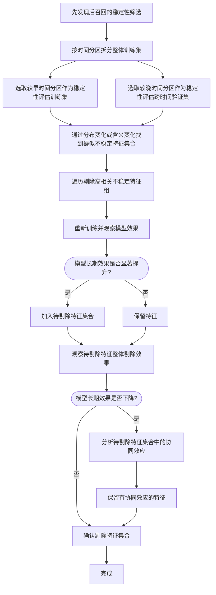

这里为什么要基于特定准则去寻找不稳定特征，而不是直接对所有特征逐个遍历这个流程呢？实际上是可以遍历的，但是这样会导致剔除效果实验时相关特征组的扩大，从而失去对相关特征部分保留的能力。

例如我们只是对分布不稳定的特征进行剔除，其相关特征组我们可以只在分布不稳定的特征中计算，这样能够实现剔除相关特征中不稳定来源的部分，而保留稳定的部分。例如同一个特征的 28 日聚合统计和自然月统计，可能相关性很高，但是自然月统计避免了在月初月末时间切片时的显著特征波动，在不同时间切片上的分布更为稳定。我们可以通过分布波动检测找到 28 日聚合的特征，然后保留未检测出波动的自然月统计特征。如果没有前置筛选的步骤，我们就无法实现只在分布不稳定的特征中进行计算了，这样会将两个特征一同纳入相关特征组，从而导致无法剔除相关特征组中的不稳定特征。

另外从可解释性和便于分析的角度，先基于特定稳定性准则筛选，有利于我们理解特征不稳定的具体情形，并结合业务含义做出更合理的判断。

不过我们也可以对各个特征进行一次遍历筛选，这样可以找到整个相关特征组都不稳定的特征来源，这也是我们基于长期效果变化的筛选的设计思路。

#### 基于长期效果变化的筛选

首先通过相关性将高度相关的特征分为一组，然后每次去掉一组高度相关的特征，重新进行训练，然后观察模型在长期上效果的变化。如果去掉的这组特征使得模型在长期上效果出现了相对显著的提升，那么我们就将这组特征加入待剔除的特征集合中。为了降低过拟合的风险，我们还可以通过修改随机数种子，改变划分的时间点和间隔天数，来进行多次实验。

得到待剔除特征集合后，我们可以对特征组对模型效果影响随时间的变化进行可视化的分析，并分析待剔除的特征含义，来对这个集合进行进一步调整，确保最终对待剔除特征集合整体提出后，模型效果有显著提升。

#### 基于特征分布变化的筛选

特征本身的分布常常会随着时间发生变化。我们这里的方法是先找到在各种指标下变化显著的特征，然后从中剔除影响模型长期效果的特征。之所以不直接剔除分布显著变化的特征，是因为分布变化并不一定带来模型效果的下降。这一点在之前的特征稳定性文章中有进行详细分析可以参考。

这里我们选用了三种方法来从不同角度刻画特征的分布变化，尽量召回更多的分布发生迁移的特征。

首先对比训练集和跨时间验证集。找到在跨时间验证集中有一定占比，但是在训练集中出现次数很少的特征分段或枚举值。这说明在未来时间周期内出现了较多训练集中未见过的特征值，模型有可能会做出错误的判断。也可以通过对比找到零值率，空值率变化很大的特征，这样的变化可能说明该特征覆盖的人群发生了较大的变化，例如来自于一个逐步废弃的旧版产品功能。通过基础的对比方法，可以帮助我们捕捉到一些在历史数据中出现局部不稳定现象的特征，且具有良好的可解释性。便于模型开发人员对特征的分布变化进行分析和理解。

另一方面，我们可以引入模型判别的方式，来对特征的联合分布迁移进行捕捉。我们将训练集的样本作为正样本，跨时间验证集的样本作为负样本，然后让模型基于已有特征对样本进行分类。如果分类效果很好，则说明特征的联合分布在不同时间有着显著区别。然后可以迭代的剔除头部特征，直到达到指定的迭代次数或分类效果下降到阈值之下为止。基于这个方式，我们可以了解到特征分布变化最大的头部特征，且考虑了不同特征在分布变化上的协同效应。

由于我们都是先召回，再处理。因此从召回的层面，我们可以将传统的 PSI 指标也纳入，将超过特定阈值的特征也纳入到分布显著变化的范围。

这里对上述三种分布变化的判别方法进行了总结：

| 分布变化判别方法             | 说明                                                                                                                         | 目的                                                                                            |
| ---------------------------- | ---------------------------------------------------------------------------------------------------------------------------- | ----------------------------------------------------------------------------------------------- |
| 对比训练集验证集特征值域范围 | 对比训练集和跨时间验证集。找到在跨时间验证集中有一定占比，但是在训练集中出现次数很少的特征分段或枚举值                       | 找到局部不稳定的异常特征；避免出现特征在未来有大量分段/枚举值从未训练过的情况，造成模型 badcase |
| 模型判别                     | 们将训练集的样本作为正样本，跨时间验证集的样本作为负样本，然后让模型基于已有特征对样本进行分类，头部特征即为分布显著变化特征 | 综合考虑了不同特征在分布变化上的协同效应，找到这样的显著变化特征组                              |
| 传统 PSI 判别                | 将超过特定阈值的特征加入到待观察集合                                                                                         | 保证召回效果不低于传统方法，通过后续的效果验证避免误删特征                                      |

在召回了分布显著变化的特征后，我们可以在跨时间验证集上进行评估这部分特征的剔除效果。如果数据充裕的话，建议在跨时间的验证测试集上进行评估，降低过拟合风险。

最后我们针对要剔除的特征，对其分布具体的变化输出对应的可视化图表，帮助模型开发人员理解特征波动的情况，引入业务知识来进一步确认这部分特征的分布变化所带来的风险。

#### 基于特征含义变化的筛选

特征含义在这里表示的是特征与预测目标之间的统计关系。即时特征分布保持稳定，这个关系也可能会随着时间发生显著的变化，从而直接导致模型效果的下降。我们这里同样也是先尽量召回特征含义发生变化的特征，然后再通过长期效果校验，结合可视化的人工 review 来确定是否需要剔除这部分特征。

在 LR 模型中，我们可以利用 WOE 值的变化来判断特征含义的变化。

对于集成树模型，可以考虑利用无量纲的 Lift 值来判断特征含义的变化。注意这里仅考虑了单特征与预测目标之间的关系，如果希望考虑多特征的效应，可以考虑引入 Shap 来进一步判断。

对于显著变化的特征，可以结合特征好坏含义随时间变化的图表，以及特征业务含义，来最终确定是否要进行剔除。并对剔除后模型长期效果进行观测。

#### 线上失效特征检验

稳定性筛选本质上是参考历史数据中的特征稳定性，对未来特征的稳定情况进行推演。为了避免信息穿越，在通常的稳定性筛选流程中也只会纳入训练集进行筛选判断。但由于常常会遇到特征在历史训练集中存在，而在最新数据集分区上已经失效的情况，如果不提前剔除这类特征，可能会导致模型训练返工。为了避免这样的问题，建议在特征筛选之初，找到线上数据最新分区上的全为 0 或者全为空的特征，与相关负责人沟通确认是否特征已废弃或停用，确认之后可以提前进行剔除。

由于不管是在测试集，还是在可预见的未来，这部分特征都确认会被弃用，所以这样的做法并不会带来信息穿越或是过拟合的问题。

### 可解释性校验 - 避免 Shap 使用陷阱

在金融信贷场景下，我们对模型的可解释性会有较高的要求。追求模型的可解释性能带来诸多好处。

从外部来看，不管是应对监管需求，还是应对客诉处理，以及来自于下游繁多的应用方对模型提出的多种疑问和挑战，一个具有良好解释性的模型更利于建立和监管，用户，以及策略产品使用方之间的信任；从内部来看，具有良好的解释性的模型也能带来诸多好处。

这里将可解释性对业务和模型带来的相关好处总结如下：

| 模型可解释性的好处 | 好处来源 | 说明                                                                                                                                                                                                                     |
| ------------------ | -------- | ------------------------------------------------------------------------------------------------------------------------------------------------------------------------------------------------------------------------ |
| 建立多方理解与信任 | 外部     | 不管是应对监管需求，还是应对客诉处理，以及来自于下游繁多的应用方对模型提出的多种疑问和挑战，一个具有良好解释性的模型更利于建立和监管，用户，以及策略产品使用方之间的信任。                                               |
| 模型迭代效果提升   | 内部     | 例如基于良好的模型可解释性，对模型 Badcase 进行分析，结合业务理解进行针对性的模型迭代，有助于快速提升模型效果                                                                                                            |
| 过拟合风险识别     | 内部     | 例如发现一些与业务无关的特征在模型的重要性排行中较高，就需要谨慎分析是来自于模型对深层次的风险模式挖掘，还是说只是模型对训练数据的过拟合导致。                                                                           |
| 模型稳定性提升     | 内部     | 例如经过解释性分析发现用户的省份信息在模型中重要性很高，需要进一步了解业务后续放量中，是否会对区域进行风险下探。如果后续会从省会城市下探到欠发达城乡地区，需要考虑剔除对应地区信息，避免模型基于历史数据对风险做出误判。 |

需要注意的是，可解释这一概念并不是客观的。可解释准确的说，应该是可被人类所理解。这是一个相对主观的判断，也正是因为他带有主观性，或者说带有专家经验和业务理解，可解释性分析能够帮助我们去避免一些纯统计分析可能会带来的陷阱和问题。

实现模型的解释性需要两个方面，模型的解释性和特征的解释性。这两个方面是缺一不可的。例如即使是使用解释性最佳的 LR 模型，如果模型所选用的特征是难以理解的，最终模型的预测也是缺乏解释性的。这里我们主要聚焦在特征的解释性上，模型的解释性会在模型开发环节进行阐述。

那么如何理解特征的可解释性呢？我们认为，可解释实际是指的人类对于模型的理解，这个理解可以看作是一种对齐。**即将人类对数据的理解，和模型对数据的理解进行对齐**。

模型对数据的理解是什么呢？模型本身的结构和参数就是代表了模型对数据的理解。而模型训练的过程，也可以看做是基于训练集特征的数据分布，将特征与目标变量的关系固化到模型结构参数中的过程。对于简单的模型，例如线性模型，我们只需要通过其结构和参数就可以理解模型的推理过程。对于复杂的模型，例如集成树模型和神经网络模型，我们难以直接理解其结构参数，需要借助外部方法将其结构和参数转换为我们能够理解的表现形式，这个步骤可以称为对模型结构和参数的**可解释性转化**。

那么人类对于数据的理解是什么呢？在这个场景下，人类对于数据的理解可以分为数据集内和数据集外。我们可以对数据集进行多维度的统计分析，从而获取到对特征的统计认知，以构成我们对于数据集中的特征的理解，例如特征的分布，不同特征分段的用户违约比例。另一部分是来自于数据集外部的知识，例如策略变更信息，特征源数据对应的业务场景和上报时机，以及生活中广泛的常识。

我们的可解释性分析，就是将这个两个理解对齐的过程。注意这个对齐过程中，模型参数的可解释性转化，数据集内的统计分析，都是可以通过工具来批量化辅助分析的。但是数据集外部知识的部分，目前只能依靠人类参与。这也是对于关键信贷风控模型在日常迭代中最主要的需要人工参与的环节。

这里可以将两类理解总结如下：

| 理解分类         | 理解来源   | 表现形式       | 例子                                   |
| ---------------- | ---------- | -------------- | -------------------------------------- |
| 模型对数据的理解 | 基于数据集 | 模型结构和参数 | LR 模型的变量与系数                    |
| 人类对数据的理解 | 基于数据集 | 多维统计分析   | 特征 odds 变化图                       |
|                  | 数据集外   | 逻辑判断       | 策略变更信息，特征源数据信息，生活常识 |

从上面分析可以看到，数据集外的人工经验是解释性分析中重要的一环。尽管无法完全消除人工经验，我们依然可以对其他环节进行优化，来提高可解释性筛选的合理性和人工效率。

首先是对于模型侧，如果是基于传统信贷领域常用的 LR 模型来制作评分卡，我们可以很简洁的完成对模型参数的可解释性转化。只需要依靠特征的系数，结合 WOE 的分段，我们就可以获得从特征值到模型分数推理过程的完备的洞察。我们可以重点关注特征的系数方向性和绝对值是否合理，WOE 的分段是否单调。对于不单调的 WOE 分段，我们需要关注其是否符合业务理解和生活常识。如果发现是 WOE 分段不合理，我们需要回退到特征分箱阶段进行调整。

对于集成树模型，例如 XGBoost，我们引入了 Shap 值来完成对模型结构参数的可解释性转化。基于特征在训练集不同数据点上的 Shap 值，我们可以绘制出散点图，用于体现模型对于不同特征值下，特征对于目标变量影响的方向与大小变化趋势。例如如果随着特征值的增加，shap 值也持续增加，则说明在模型的理解下，特征的影响是随着 label 变化而单调递增的。如果在特征值大于特定阈值后，shap 值突变并保持，则说明模型认为这个阈值时一个关键的改变点，一旦突破这个阈值，用户的违约概率会发生突变。

基于 Shap 值散点图，我们可以从单特征模型预测倾向分布的角度，对模型进行理解。但对于模型开发者而言，可能会因为自身缺乏对特征的理解，从而无法判断模型对特征的理解是否合理。而在大数据场景，可能会有数百个特征，逐个精细分析花费的工作量也是巨大的。如何在实践中快速找到可能有问题的特征呢？我们可以结合信贷风控场景来简化这个问题。

观察信贷风控模型的入模特征可以发现，大部分的行为统计类特征都遵从两种主要的模式。

1. 特征值和特征好坏含义保持单调，即值越大越坏，或值越大越好。
2. 特征值大于一定阈值或小于一定阈值后，用户的违约率会突变

对于这两类情况的特征，我们可以通过**odds 变化曲线**来作为参考，帮助模型开发者快速识别特征业务含义，并理解模型判断的统计基础。

odds 变化曲线是从训练集的统计数据角度绘制，展示特征自身随着特征值变化，好坏含义的变化曲线。模型开发者可以通过对比统计变化和模型 shap 值散点图，快速找到存在显著不一致的特征，即与人类统计无法对齐的特征。例如 shap 散点图是单增曲线，而 odds 变化曲线为单调递减。或者说 shap 散点图和 odds 变化图在特定区域出现了背离。

注意对于这样的异常特征，我们并不能直接剔除。因为不管是这里的 Shap 值还是 odds 值，都是某种形式上的单特征分析。出现不一致很有可能是受到其他特征的协同效应影响，以及某些特别的数据分布导致，需要结合多特征进行分析或者局部拆解分析来辅助特征理解。

另外要注意的是，odds 曲线对比主要是用于帮助快速发现解释性可能异常的特征，但即使对比趋势一致，也并不保证特征解释性就是合理的。对于头部特征，还是需要结合数据集外部知识和更多的数据分析来确保对于这部分特征有着充分的理解。

另一个重要的点是对 Shap 值的计算。因为对于集成树模型的解释性分析核心在于对 Shap 值的分析，如果对 Shap 值计算有误的话，会导致解释性分析出现偏差。

这里的 Shap 的计算公式如下

$$ \phi(i) = \frac{1}{n} \sum*{S \subseteq N*{i}} \frac{v(S \cup i) - v(S)}{\binom{n-1}{|S|}} $$

其中 i 是目标特征， n 是特征个数，N 是特征全集, S 是从特征全集中排除特征 i 后，能够构成的特征组合(coalition)之一， v 是对特征组合平均贡献的估计函数。

关于对 Shap 值本身的理解，可以参考我之前的文章博弈论与机器学习的碰撞 - 探究模型 Shap 值背后的秘密，因果推断与模型解释性工具的结合-探究 Shap 干涉模式背后的秘密，两篇文章分别分析了传统 Shap 值，以及结合因果推断后的干涉 Shap 值的计算过程和背后的理论，并给出了应用的建议。

#### Shap 值的应用误区

关于 Shap 值的应用，最大的误区在于没有认识到 Shap 值的相对性，即基于 Shap 计算的特征影响和特征重要性，实际上都是一个**相对值**，只是在特定的参考集或者训练数据上的影响，而非一个绝对的概念。

例如同一个特征用户曾逾期最大天数，相对于逾期客群上，大盘，以及采样后的训练集数据，分别计算 Shap 值，观察其重要性排序，差别会非常大。在逾期客群上，由于大量用户过去曾逾期，因此该特征对输出的影响被削弱。在大盘样本上，曾逾期用户较少，该特征重要性显著提升。在训练集数据上，该特征的实际重要性收到采样比例影响，可能会介于大盘和逾期客群之间。

再例如一个黑灰相关的特征，在历史放量批次客群上，该特征的 Shap 值以及排序可能都会很高。但是在新放量批次上，会发现该特征 Shap 值很低。原因是在新放量批次上外部策略对该黑灰特征进行了拦截，导致用于模型评估的新放量批次人群该特征值不再具有好坏区分，对模型的输出几乎没有影响。

结合例子可以发现，Shap 值是一个相对值，我们选用的参考客群会影响我们对于特征的判断。在对模型的特征进行解释性分析的阶段，我们需要开启干涉分析模式，并使用训练数据作为参考客群，以获得在训练数据集上符合 Shap 性质的特征重要性。

### 小结

特征筛选是信贷风控模型开发中的关键流程。合理的特征筛选可以大幅降低特征数量的同时，让模型的效果不会降低，甚至有所提升，同时能够很好的满足金融场景对与高稳定性和可解释性的要求。

我们的新流程已经广泛运用到了各个业务和风控模型的开发。基于我们的新流程，在同样的模型结构和参数下，模型效果相比旧版流程会提升 5%到 10%，且大幅减少了最终入模的特征数量。

## 模型开发

### 模型选型 - 奥卡姆剃刀原则

模型可以理解为在特定数据分布下提取特征与目标向量关系的工具。模型在很大程度上决定了能够抽取出怎样的特征关系。由于模型与特征的联系如此之紧密，所以实际上在特征筛选的早期，我们就需要对模型进行选型了。

传统信贷领域通常会使用 LR 模型进行开发。在现代数据场景下，LR 模型受限于自身的线性组合特性，对特征的提取能力有限，依赖于大量相对繁琐的特征工程，以及精细的 WOE 分段设计，主要适用于在业务早期数据量很少的时候，结合专家经验建立一个基础版本模型。

随着样本量增加，可以通过集成树模型例如 XGBoost, LightGBM 来达到更好的业务效果，也能降低前期的特征工程工作量，提升迭代效率。注意对关键超参数，例如树的最大深度，minChildWeight, 正则项参数等进行调整，缓解过拟合问题。

如果特征数据来源几乎都是统计类数据，集成树模型是当前最佳的选择，不会考虑采用深度神经网络。从已知的实践和文献来看，对于统计类数据的关系提取，后者在效果和效率上都不会好于集成树模型。

如果存在非结构化的特征数据来源，例如文本，序列，关系图等信息，可以根据风控场景对于模型可解释性的要求，选择合适的方案将其纳入到模型中。

对于需要可解释性的场景，可以首先通过通过分析统计的方法去捕捉比较显著的 pattern。例如特定的关键词词频，序列模式统计，图的出度入度统计，中心性指标等。将这些指标入模，以快速获取可能的效果提升。

进一步的，需要希望纳入更深层次的关系，可以通过制作子模型的方式，将非结构化信息聚焦到具有业务含义的目标上，然后将模型输出的 logit 纳入模型。

而对于不需要模型可解释性的场景，可以通过类似 Wide & Deep 的方法，将结构化数据和非结构化数据一同纳入到模型中进行联合训练，以寻求更极限的模型效果。同时需要注意的是，复杂网络类模型对样本量的要求相对集成树模型会更大，需要尤其关注是否存在过拟合问题。

对于采用复杂网络构建的模型，需要注意和统计方法，子模型方法的效果进行对比，如果没有显著的效果提升，尽量采用最简单的模型构建方式，有助于减少过拟合风险，提升模型可解释性，也能够降低部署和维护的成本，提升模型推理效率。

这里将上述模型选型建议总结如下：

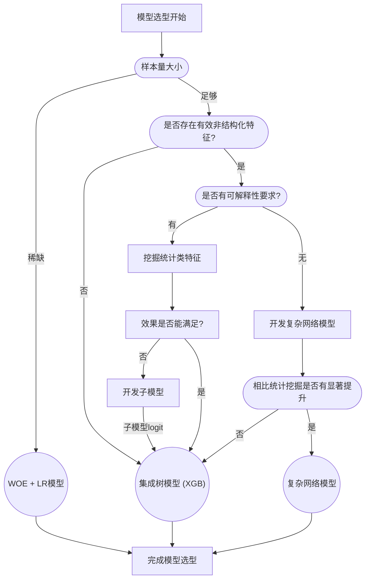

### 模型 Loss 函数优化

在模型开发过程中，对于特殊的优化目标我们可以考虑对模型的 loss 函数进行优化。例如引入 focal loss 方法，让 loss 聚焦于更难区分的样本。或者自定义 loss 函数，对不同类别错误成本不同的情况，可以考虑将误判成本纳入到 loss 目标中，从而构建出成本敏感的风险预测模型。具体的 loss 设计方式需要根据业务场景需求和数据情况来决定。

### 验证集信息泄露的问题

对于最终用于评估模型效果的测试集，在模型完成开发前，模型开发者需要避免基于与测试集有关的任何信息去调整模型设置，不然会导致测试集信息泄露，模型效果被高估。

对于用于调整超参数以及特征筛选方法的验证集，事实上也存在信息泄露导致过拟合的问题。

审视整个训练流程我们会发现，在很多地方都使用到了验证集作为我们超参数调整以及特征筛选流程中的反馈。尽管验证集没有直接参与训练，但是通过我们的参与，验证集的信息还是被持续的泄露给了模型，且信息泄露持续增多。这样可能会导致模型在特征筛选中使用的具体方法和参数，特定适合于验证集，但是不一定适合测试集，以及线上数据。

在样本量很大的时候，这个问题可以得到缓解。对于样本量较小的数据，我们可以采用交叉验证的方法来降低过拟合的概率。

另外在进行参数方法选择时，如果有更保守，更简单的参数和方法，且与复杂的参数方法效果相相差较少(例如 auc 差距<0.001)，选取更简单的参数和方法通常会让模型具有更好的泛化性。例如在超参数搜索中，避免直接排序选取效果最佳的参数，而是在效果差距很小的头部参数中，选取使得模型结构最简单的参数。

在数据量很充裕时，也可以再额外划分一个验证测试集，用于测试在验证集上进行多次参数选择后的效果。需要注意的是验证测试集只能用于建模流程中的关键节点的验证，他和验证集的区分在于用于验证效果的次数。如果验证次数过多，会退化到普通验证集。

## 模型评估

### 多指标评估 - 贴近业务目标

在传统信贷风控领域，通常都会使用 KS (Kolmogorov-Smirnov) 指标来评估模型效果。

KS 的定义很直观，就是取正类（例如违约）和负类（例如未违约）之间累积分布函数的最大差异。

$KS = max(F(t) - G(t))$

这里的 t 表示不同阈值，F(t) 是在阈值 t 时，正类的累积分布函数，G(t)是在阈值 t 时，负类的累积分布函数。KS 指标取到最大差异的点$t_{max}$，同时也对应着模型分数对好坏用户区分力最强的拦截点。

但是在我们的实践中，会发现使用仅 KS 进行模型评估，会带来很多问题。要分析这里的问题，我们需要先明确模型评估指标的意义。

风控模型最终意义在于帮助业务识别和预测风险。我们之所以需要设计模型评估指标，是因为在建模阶段难以直接对最终的业务指标（例如业务利润率，余额逾期率，在贷金额）进行观测，退而求其次我们设计针对模型的指标来间接体现出模型对业务可能的帮助。也正是如此，最好的评估指标不是一个确定的方法，而是最贴近业务场景需求的方法。例如在贷前黑灰拦截场景下，头部黑灰用户的准召最贴近于业务目标，也是最适合的评估指标。在贷前确定用户初始额度的场景下，需要对全体用户进行排序定额，因此考虑全局排序性的 AUC 指标就是最适合的评估指标。

在最终的模型评估中，通过统计历史表现数据，例如特定坏用户的坏账率，拒绝用户的损失估计，我们还可以进一步对模型进行成本效益评估，对比不同模型利润最大的决策点。这样可以进一步缩短模型的在统计上的效果与业务上的效果之间的 gap。因为不管是 AUC，还是 KS，实际上都没有考虑不同类型错误的成本。例如在贷前场景下，将好用户拒绝的成本和将坏用户放过的成本差距是很大的，通常放过单个坏用户带来的成本损失远大于拒绝单个好用户带来的利润损失。通过更贴近业务的评估，我们可以进一步了解到模型对真实业务的实际影响，便于我们做出更有益的决策。

回到 KS 指标，由于它仅考虑了最大区分点，但忽视了整体的排序性和多个阈值决策下的效果，因此在大多数场景下 KS 并不是最佳的评估方法。且由于 KS 仅考虑了区分度极值，会导致 KS 会受到评估样本中的异常值的较大影响，造成不同样本下的 KS 值波动较大。这个问题在小样本评估的情况下会更为显著。如果仅依靠 KS 来指导小样本评估，可能会导致模型优化走向一些不必要的方向。

对于常规的信贷风控模型，推荐在建模过程中基于 AUC 和贴近业务目标的评估指标（例如头部准召）进行多指标评估。

这里使用 AUC 的好处是提供了一个相对稳定且通用的评估标准，便于我们判断模型本身的性能是否达标。AUC 的原始定义是 ROC 曲线下的面积，它有一个更直观的理解是模型将随机正样本排在随机负样本之前的概率。即，如果我们随机选取一个正样本（违约）和一个负样本（非违约），模型有多大的概率会预测正样本的得分大于负样本。由于它是对模型在各种分类阈值下整体性能的衡量，所以对样本波动和异常值相对不敏感，很适合各种场景下的模型效果衡量。

这里对相关指标的常用场景做一个简化的总结：

| 应用场景     | 常用指标推荐                         | 主要关注点         |
| ------------ | ------------------------------------ | ------------------ |
| 定额定价     | AUC，分段 Lift 值                    | 排序性，单调性     |
| 准入名单筛选 | 头部召回，AUC, 头部 Lift 值          | 头部召回           |
| 资金预估     | MAE, MAPE                            | 绝对偏差和相对偏差 |
| 风险拦截     | 不同拦截率下的风险召回，头部 Lift 值 | 策略拦截率下的召回 |
| 外部风控沟通 | KS, Lift 值                          | 模型效果对齐       |

### 分客群评估 - 更真实的模型效果

模型效果实际上很难通过单个数值来定义，即使是贴合业务目标而制定的评估指标，如果缺乏合理的客群划分，也难以概括模型实际的效果变化。在实践中，同一个模型在不同客群上的效果可能会有很大的差别，简单的对整体大盘计算一个模型效果值，可能会高估或者低估模型在关键客群上的效果。

例如对于贷中模型来说，不同账龄的客群效果可能会有很大差别。通常来说，账龄越长，模型效果会越稳定。而在短账龄上，模型效果可能会退化为接近贷前模型。对于不同额度使用率的用户，模型的效果也会差别很大，对特定额度使用率客群进行效果评估，模型效果可能会显著低于大盘预测效果。对于贷前模型而言，模型在不同放量批次用户上的效果也可能有很大差别，在逾期率更高的客群进行评估通常效果会更好。

即使是类似的客群，例如同一名单下的用户，在不同的时间节点放量也会造成模型效果的变化，甚至是显著变化，尤其是在放量策略发生改变（例如策略应用的模型拦截阈值调整），以及新的放量时间点应用了新的贷前模型之后，会造成不同时间节点的客群样本区分难度突变，最终导致模型效果的突变。

因此如果我们仅仅对于当前最新的所有大盘用户进行一个效果评估，获得的评估指实际上是多种复杂因素的综合，如果直接应用于模型效果对比和观测，会造成很大的理解偏差，甚至导致错误的判断。

更合理的方式是对各个业务客群进行拆分，对比观察模型在细分客群上的效果。例如不同账龄，不同放量批次，不同额度使用率，逾期情况的客群，都可以进行拆分。下游策略在应用和评估时，也需要将实际会影响的客群单独选取出来，进行效果评估，且在评估中注意避免与训练验证集重合造成效果穿越。

通过这样的方式，我们可以更了解模型在各个客群上的优劣，充分的了解模型更真实的预测能力，也能够指导我们后续对模型的薄弱客群进行针对性的效果优化。

### 单调性评估 - 确保策略合理性

对于整体排序有要求的风控模型场景，例如调额调价场景，还需要额外进行单调性评估。即随着评分分段的降低，对应人群的关键指标（例如逾期率）应该升高。

在实践中，即使模型的 AUC 尚可，这种分段不满足单调性的情况依旧有可能出现。遇到这种情况，可以首先观察用于评估分段逾期率的样本是否充足，尤其是逾期的样本，如果样本过少，可以改变口径或等待累积更多样本后再评估。也可以考虑重新划分分段，增加各个分段的内的逾期样本数量。

如果经过上述两种方法，模型评分依然不满足单调性，需要对模型进行更深入的分析。统计异变前后分段群体的差异，以及借助 Shap 分析模型对用户这部分用户评分的重要特征，找到造成异变的主要影响特征。基于分析结果，对模型进行优化迭代，通过剔除或变换异常特征，更新样本，优化模型结构等方式，最终确保模型的分段上关键指标的单调性。

### 用户 Case 分析 - 了解用户，感知模型

不管是 AUC，还是 KS，都只是对模型整体预测效果的统计评估。我们仅仅知道了对应的效果数值，那么模型具体在单个用户上是怎么进行预测的，以及对于具体的案例模型是怎么漏判的，都缺乏一个深入的理解和直观的认知。

通过对具体的模型预测 Case 进行分析，有助于我们了解模型的局限性，发现模型预测错误的原因，从而指导我们更好的应用模型，以及针对性的迭代优化模型。对于 LR 模型，我们可以简单的通过模型参数和 WOE 分段进行分析。对于集成树类型的模型，我们需要通过 Shap 对案例进行分析。可以参考前述的相关文章 对 Shap 进行了解。

我们将 Case 分析涉及的数据范围分为两类，一类是基于模型特征进行分析，可以有助于我们发现数据质量，特征工程方面的问题；另一类是对处于模型特征之外的用户画像和历史行为日志进行分析，有助于通过挖掘新的行为模式和统计特征来优化模型。

从 Case 本身的预测类型上，在二分类场景上，可以分为 TP, FP, TN, FN 四类。在信贷风险预测场景上，分别对应成功预测违约，错误拒绝非违约用户, 成功预测非违约用户，放过违约用户，

其中建议着重对放过违约用户 (FN) 的案例进行分析，这也是主要带来资金损失的情形。对于这类用户的 Shap 分析，可以考虑与违约客群进行对比，用于了解模型为什么没有将该类用户预测为违约，具体是哪些特征的差异。

其次对错误拒绝非违约用户 (FP) 的案例进行分析，这类 case 会带来业务的利润损失。对于这类用户的 Shap 分析，可以考虑与非违约客群进行对比，用于了解模型为什么将该类用户预测为违约，具体是哪些特征的差异。

对于以上两种 Case，也需要对模型特征之外的画像和日志进行分析，观察是否有遗漏的 pattern 和信息可以帮助捕捉对应的用户。

对成功预测违约 (TP) 和成功预测非违约 (TN) 的案例，可以基于 Shap 快速查看核心特征，用于验证模型判断的方式与预期是否一致。如果发现模型是基于某种捷径或者难以理解方式得到预测结果，需要对模型进一步分析，以避免可能的过拟合或者信息穿越的问题。

这里将上述用户 Case 分析的关注点总结如下：

| 用户 Case 分类          | 重要程度排序 | 模型特征关注点                                         | 外部数据关注点         |
| ----------------------- | ------------ | ------------------------------------------------------ | ---------------------- |
| 违约用户放过 (FN)       | 最重要       | 对比与违约客群在 Shap 上的区别                         | 行为日志，用户画像挖掘 |
| 错误拒绝非违约用户 (FP) | 相对重要     | 对比与非违约客群在 Shap 上的区别                       | 行为日志，用户画像挖掘 |
| 成功预测违约 (TP)       | 验证         | 验证模型常用头部特征是否符合预期，避免过拟合或信息穿越 | 通常不需要             |
| 成功预测非违约 (TN)     | 了解         | 验证模型常用头部特征是否符合预期，验证特征工程是否合理 | 通常不需要             |

## 模型监控与维护

信贷模型上线后，由于下一批样本回收需要时间，且策略也需要依赖一个稳定的模型进行策略开发，因此通常都会在线上持续推理一段较长的时间。在这段时间内，如何保证模型效果稳定则是一个至关重要的问题。相比在测试集上的效果，模型线上生命周期内的跨时间模型效果才是真正衡量模型对业务有效的一个指标。

### 事前监控 - 定制化，高效率

对于模型而言，事前监控主要就是对特征的波动进行监控。

传统的特征波动监控会对模型的依赖各个特征来源进行计算，例如一些大盘的特征表，会逐个特征计算其 PSI，因为特征表在不同模型中可能存在共用情况，所以往往还会是每日定时对特征表进行中心化的统一计算。但在业务实践中，这样会带来几个问题：

1. 由于无法对齐目标客群，而引起误判或漏判。信贷模型推理的客群与大盘客群的分布区别较大，甚至很多特征可能只有信贷推理客群才有特征值，如果直接套用大盘的稳定性指标计算结果，而非特定客群，例如开通客群，支用客群上的计算结果，会导致特定客群上的特征波动被大盘人群平滑，最终导致特征异常漏判。
2. 由于难以自由设置稳定性计算方式带来的误判或漏判。基于中心化的监控计算，模型无法根据自身需求自由设置稳定性指标计算的分箱方式等细节要求，从而带来较多的特征误告警或漏告警。
3. 从计算资源上存在大量浪费。在已有数据场景中，单个特征表的特征利用率很低，常常是一个模型只会纳入单个特征表中的几个特征，但是对于表级别的稳定性计算，却需要对整个表进行计算。对于实际无人引用的特征计算稳定性指标会浪费大量计算资源。另外模型推理的人群范围可能远小于大盘人群，对于实际不需要关注的人群计算稳定性指标也会造成计算资源的浪费。
4. 从时效性上会带来下游模型结果产出的延时。由于是中心化计算，需要等待定时调度，且可能会出现单点性能问题，且未考虑模型实际需求，计算量会更大，因此计算的时效性会差于单独只计算模型所需的部分。对于月模型来说这个影响较少，但是对于日模型而言这个影响会很明显。
5. 从配置层面来说会让模型监控配置任务过于繁重。单个信贷模型往往会依赖数十个上游特征表，每次上线模型都需要配置各个特征表以及表内使用的特征，即使可以进行一些自动化操作，配置成本和配置管理成本依然是存在的。

为了解决这一系列问题，我们提出了即时监控，独立计算的方案。

可以发现，传统的方式中我们的监控计算是以特征表作为主体的，在特征表之上进行计算，计算结果以特征表作为主键，然后下游去引用这个结果。但是从业务角度出发，特征表本身对于风控而言并不能起到作用，只有依托于具体的模型和策略，特征才会影响到业务表现。而现有的特征表和特征数量是巨大的，但是模型和策略实际仅引用了其中很小一部分。如果转变思路，基于模型和策略作为主体去计算其引用的特征，这样能够让每个模型和策略可以灵活的定义其需要的特征监控计算方式，计算需要参考的特定客群。这样监控计算依附于模型和策略，以模型策略作为主键去管理，能够同时解决自由配置和时效性的问题。

对于风控模型场景，还有一个额外的优势在于，模型在进行推理前，总是需要将推理样本与各个特征表拼接，产出一张带有全部入模特征的宽表。通过以模型为主体的设计，我们在配置模型的监控计算时，实际上只需要基于这个宽表进行稳定性指标计算即可。因为宽表仅包含入模特征和模型总的推理人群，已经符合了我们模型对稳定性计算的数据需求了。这样也就解决了计算资源浪费问题。

从配置上，我们也不需要再繁琐的配置多个上游特征表和字段，只需要导入宽表信息即可。

基于宽表，我们可以将监控任务作为宽表产出任务的直接下游，同时也作为模型推理任务的直接上游。这样的能够实现最佳的时效性，即上游数据准备完成后，监控会马上开始计算，监控一旦通过，下游也会马上启动，消除了中心化定时调度中的等待时间。

从灵活性上，由于各个模型的宽表不同，我们实际上可以解耦不同模型间的稳定性计算。每一个模型对应一个单独的宽表特征监控计算，用户也可以对各个特征根据需要，单独设置特定的分群计算方式以及稳定性计算方式。

这里新版监控模式的改进总结如下：

| 监控改进点 | 说明                                                             | 好处                                                                     |
| ---------- | ---------------------------------------------------------------- | ------------------------------------------------------------------------ |
| 客群划分   | 新版监控允许为特征划分不同的客群进行细分监控                     | 1. 避免特征值被大盘平滑造成异常漏判 2. 避免非目标客群波动造成误告警 |
| 自定义分箱 | 新版监控允许为特征设定自定义的分箱点和分箱方式                   | 减少特征误告警和漏告警                                                   |
| 计算效率   | 新版监控只对入模特征进行监控，而非全量特征，且只关注模型推理人群 | 1. 避免了大量计算资源的浪费 2. 大幅缩短了计算所需时间               |
| 时效性     | 新版监控计算在上游数据产出后即时触发，无需等待中心化定时调度     | 有效缩短了模型产出的链路时间，提升了线上模型实际效果                     |
| 便捷性     | 新版监控无需配置多个上游表，只需在前端界面导入宽表信息即可       | 有效减少了模型上线前所需的部署配置时间                                   |

这里给出传统监控和新版本监控在流程上的对比图示，左边为传统监控，右边为新版监控：

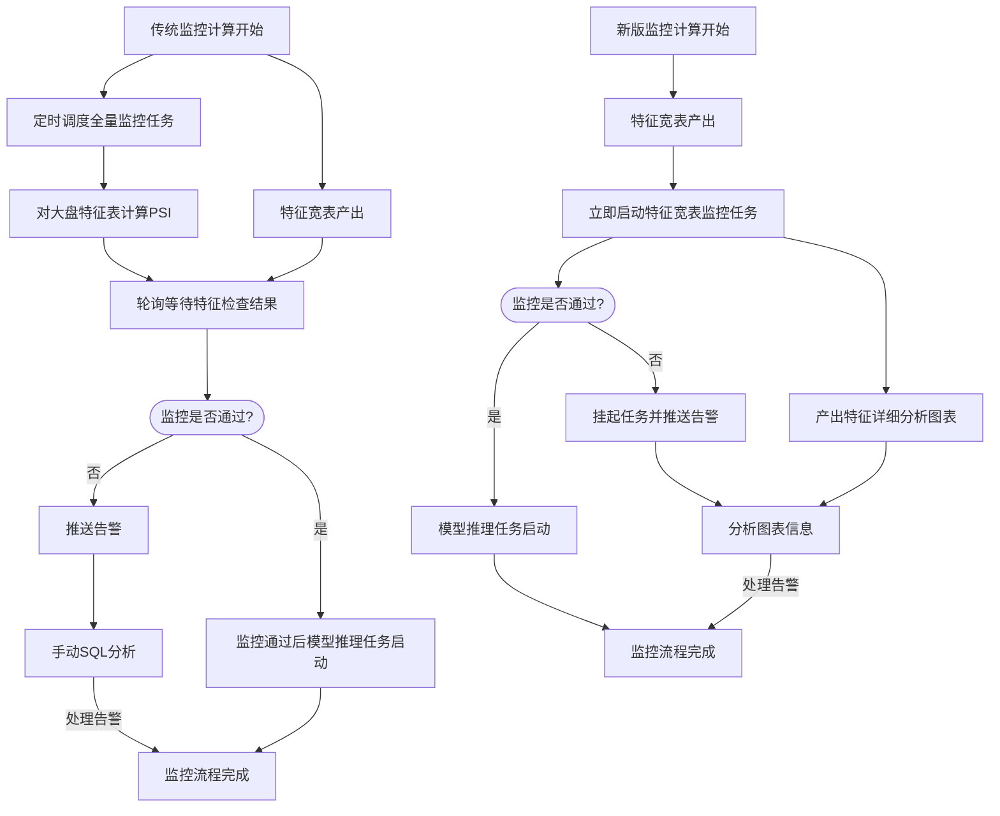

结合流程图和对比表格可以发现，新版监控更为简洁高效，功能更全面，也更加贴近信贷风控监控的业务需求。结合即时监控的方式和更合理的 PSI 指标计算处理，这套事前监控体系已经帮助模型，策略在内的多个业务场景，在第一时间发现了上游特征问题，且相比现有监控体系大幅降低了漏判率和误判率，有效避免了数据波动引起的风控异常。

#### PSI 指标计算在实践中的处理

对于具体的稳定性指标，目前在事前监控上我们依然采用 PSI 作为主要监控指标。虽然我们在特征筛选的环节有分析过其存在的种种问题，但是在线上特征稳定性监控领域，我们可以采用多种方式来缓解 PSI 的问题。

1. 对比特征历史 PSI 指标波动范围确定 PSI 阈值
2. 根据特征分布或模型分段点自定义特征分箱方式，以及设置自定义的分箱分段点
3. 根据特征正常的周期性波动设置的动态变化的监控阈值
4. 展示分布变化的柱状图对比等详细变动信息，辅助确认特征变化是否合理

另外在现有数据环境下，大量特征存在较高的 0 值和空值占比。一个推荐的做法是将 0 值和空值拆分单独计算，并对其 0 值率变化，空值率变化进行独立监控。这样可以避免在等频分箱场景下，0 值空值挤占了更有业务含义的特征值空间的问题。

通过上述方式，我们可以缓解部分 PSI 存在的问题。而对于更关键的特征，可以引入特征迁移监控对特征变化进行更精细化，更具有解释性的分析。

特征迁移相比传统分布变化监控的区别在于，从分布监控只能从数据整体知道分布的变化情况，但是无法从用户角度得知具体分布变化的方向性和来源。但是迁移的监控信息量会更大，所以更适合对关键特征和关键数据，包括模型输出结果进行监控和分析。

#### 特征异常时的处理方式

在生产环境中，特征出现稳定性指标波动实际上是一个常态的事情。我们生活的世界是在不停变化的，而与之相连的特征表象，也必定是持续改变的。一个分布极度稳定的特征是无法及时捕捉用户当前最新状态的。

我们的事前监控是完全基于特征分布来变化来进行的。当特征分布发生突变，事前监控发现异常时，我们应该如何处理呢？

首先需要进一步获取具体的变化信息，包括查看特征的分布变化图表，在子客群上的监控指标，部分关键特征还可以分析其特征迁移矩阵。然后再结合特征的业务含义，以及业务背景等，判断是否是正常的业务波动。实际上 90%以上的告警都是来源于正常的业务波动。

例如新用户放量会带来放量用户客群的部分特征稳定性指标波动，因为客群被改变。这时候可以关注已开通客群，或者在贷客群相应特征的稳定性指标是否有波动。如果没有波动，就可以确定特征本身并无异常。

又例如在特定的节假日，部分特征会有发生突变。这种情况下可以对比往年的同一节假日周期，观察是否有同样幅度的变化。

如果经过分析，确认是异常波动，尤其是特征变为全空全 0，或者枚举值发生突变的情况。很可能是由于上游产品变更或者数据上报路径发生了变化。这个时候我们可以及时回溯数据生产路径，找到数据突变点的相关负责人，看是否能够及时修复或者补回特征。

如果无法修复，或者需要较长时间修复，这个时候就需要对模型侧进行处理了。

首先定位到异常特征，查看模型文档，确定特征在模型中的特征重要性。对于特征重要性低的模型，可以将特征固定到最新的正常数据分区，直到特征修复后再还原到取最新分区数据。同时注意在模型正常产出前，观察操作对模型评分分布和迁移率的影响。如果模型评分分布和迁移率变动较大，则需要考虑固定模型分数并及时开发新模型。

如果特征重要性高，在固定分区数据后，同样需要查看该操作对于模型评分分布和迁移率的影响。如果影响较大可以进一步考虑暂时固定模型评分。同时需要及时剔除该特征，寻找类似的其他特征尽快重新开发模型，替换旧版模型。

我们可以将上述流程总结为下图：

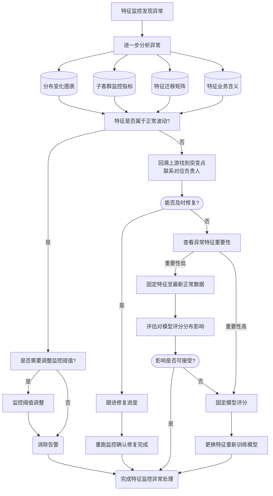

作为模型开发者，我们可以在模型构建的特征筛选环节剔除掉采用历史已经表现出不稳定的特征，无人维护的特征，以及将要废弃的特征，去尽量避免这种情况。以及对于关键模型的头部重要特征，也可以提前与上游进行进行沟通，尽量避免发生重要特征无法修复的问题。如果真的发生了，可以通过固定特征或者固定评分，并利用已有流程快速迭代模型来处理，将对业务的影响控制到最低。

### 事中监控 - 业务连续性的关键保障

信贷模型场景下，事中监控主要是为了确保模型推理没有出现技术性的故障或者显著偏离预期。事中监控也是实质性保障业务稳定的关键监控。一旦事中监控发现问题，需要设计自动回退或降级机制，并及时告警。

在实时模型场景下，我们可以通过策略引擎配置实时告警和熔断机制，来实现在模型拒绝率发生突变时，及时告警和阻断降级。

在离线场景下，如何实现监控发现问题时，能够及时自动化的回退降级呢？我们设计了阻断性监控加定时落库的方式来实现。这个方式需要配合三个模型分数数据表：

1. 未经过校验的临时模型产出表
2. 校验后的对应日期模型产出表
3. 用户最近一次校验后模型分数快照表

策略应用时，对于高时效性的线上任务，可以依赖于最新分数快照表；对于历史回溯类任务，可以依赖于校验后对应日期的模型产出表。这样也可以在满足下游任务例行化开发方式的情况下，缓解上游特征可能发生延迟的问题，

这里的阻断性监控是指监控任务一定要作为关键任务的上游依赖，避免未及时处理告警导致下游任务产出。对于离线模型而言，即必须通过分数稳定性监控后，才会将分数写入对应日期校验后模型分数表中，供下游策略使用，否则任务会失败或挂起，并视重要程度通过企微，短信，电话等方式进行告警。

在实践中，告警的发生是相对频繁的，一个是因为上游特征出现不稳定情况是常态，另一个也是因为我们希望告警相对敏感，因为误告警的代价远小于业务出问题的代价。为了应对在告警发生时，如果特殊情况下没有及时处理，在任务挂起时，下游任务依然可以正常运行，我们周期性的把最新的校验后模型产出数据写入分数快照表。在上游特征发生延时，或任务因为特征告警被挂起时，由于分数快照表只能快照到上一时间周期的校验后分数，事实上就等于回退到了上一版本，避免了业务出现异常。

上述离线部分监控流程可以总结如下:

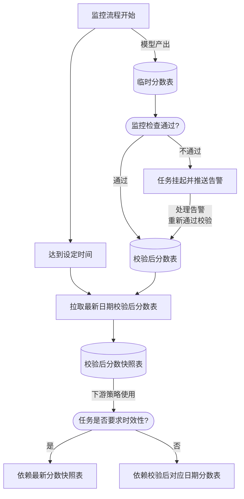

事中监控是实时模型和离线模型日常推理过程中最关键的一个监控项，可以避免模型分数发生大规模的异常，造成线上资金损失。对于重要模型务必配置充分的告警和告警提醒方式，并搭配自动化的阻断和回退方式，确保不依赖人的情况也可以保障业务安全。

### 事后监控 - 模型迭代指标

在信贷模型场景下，除了通过事中监控来保证模型没有技术性的偏差外，还需要事后监控来帮助我们了解模型实际的线上效果，指导我们在线上效果下降时及时完成模型迭代。注意由于信贷场景样本回收的滞后性，我们实际对模型效果的反馈是来自于表现期周期之前逾期的样本，因此我们无法使用更为准确的基于效果的事后监控，来代替基于模型分数分布稳定性的事中监控。

传统信贷风控领域通常会对模型的 KS 进行监控。但是在模型评估环节我们已经对 KS 指标进行了分析，在很多情况下都不是一个好的监控指标，但是仍然可以保留 KS 作为展示作用，因为 KS 作为传统的风控效果指标，便于不同业务背景的风控人员对效果感知对齐。进一步的，我们可以采用多指标监控的方案，分别应对不同的使用人群。例如模型开发人员可以更多的关注模型 AUC 和业务相关指标（例如头部准召）的变化，而下游应用人员可以以业务相关指标的监控为准。如果下游应用人员的应用场景与模型默认监控场景不同，注意在应用场景上开发专门的事后监控，预防模型在特定场景上失效的问题。

这里需要特别注意的是，除了模型全局的 AUC，KS 等效果指标，对于模型分数细分分段的效果指标，包括对应的好坏人数和总人数也需要纳入到事后监控当中。例如头部分段的违约人数，召回率，这些信息能够让我们聚焦到模型关键的局部效果，避免遇到整体效果指标波动不大，但是头部效果衰减严重，导致模型未能及时调整的情况。另外容易忽略的是，对于上述事后关键指标，也应该设置好对应的告警，在效果低于阈值时自动提醒，便于及时排查问题，修复模型。

除了效果监控以外，由于信贷模型通常需要在线上使用较长的时间，还可以考虑对模型进行分数迁移监控。之所以列为事后监控，是因为分数迁移在实践中主要用于定期分析用户分数变化的趋势，例如观察同一放量批次的用户分数的迁移趋势是否正常。

| 常用事后监控项                                                     | 作用                                                               |
| ------------------------------------------------------------------ | ------------------------------------------------------------------ |
| 模型分段评估值，包括分段违约人数，召回率，精准率，分段 KS, Lift 等 | 帮助聚焦到模型关键的局部区分能力； 帮助关注模型单调性是否维持 |
| 全局 AUC，KS 变化曲线                                              | 帮助了解模型整体排序性，便于设置告警阈值                           |
| 关键客群下的效果变化曲线                                           | 帮助了解模型在目标客群上的效果                                     |
| 业务拦截口径下的召回率，误拦率                                     | 帮助了解模型在目标口径上的效果                                     |

## 流程工具化

上述总结了多种信贷模型开发过程中的实践流程。如果全部都依靠手动进行，会给模型开发人员带来一定的负担。因此我们对各个环节进行了尽可能的工具化和自动化，确保模型开发人员只需要关注真正需要人工参与，带入业务经验的地方，而非大量重复的劳动环节造成人力的浪费。

### 特征开发流程的自动化

这里涉及到两个方面，全量挖掘和例行化特征产出 sql 的构建。

全量挖掘主要是对业务流水日志的自动化基础挖掘。 这个是通过配置相关的流水表，业务字段，以及样本场景后，触发工具的自动化枚举和组合的方式来进行的。

而例行化的多时间窗口的衍生特征构建，这个在特征开发环节已经有所阐述，通过相关的 Sql 生成工具，开发人员只需要填入必要的目标衍生口径对应的 Sql，以及需要的各个时间窗口，就可以完成完整特征衍生 sql 的创建。

通过这套特征开发流程，我们完成了多版业务特征体系，以及大盘特征体系的搭建。

### 即时监控体系

这里主要是借助前端维表完成相关监控配置，然后通过设计好的报表界面模版，结合企微告警推送，实现不同模型可以共享同一套监控，报表和告警体系，无需对每个模型单独进行报表设计和代码撰写。目前已应用到了多个业务场景。

### 模型案例分析工具

对于已经开发好的模型，我们可以利用 Shap 结合统计指标对客诉等 Badcase 进行分析。为了避免 shap 应用中的一些问题和陷阱，这里开发了模型案例分析工具， 协助了多个业务模型的 badcase 查询。

### 模型开发标准化流程

模型开发的标准化流程是整个模型开发流程工具化的重点。信贷风控模型的开发环节众多，面对越来越丰富的下游业务场景，如何在保证模型高质量的前提下，快速迭代模型，覆盖更多应用场景成为了一个亟待解决的问题。

我们希望可以整个流程尽量的自动化，让模型开发人员只需要关注真正需要人工参与，带入业务经验的地方，而不需要把大量的时间浪费在重复的代码开发过程。同时我们也希望各个模型开发人员可以有一套共通的 baseline 作为参考，在此基础上进行进一步的优化，沉淀和分享好的流程方法。

基于这样的背景出发，我们设计了一套底层的信贷风控建模库，以及信贷建模的标准化流程，可以提供工具化的建模流程支持，以及效果良好的建模 baseline 参考。

需要注意的是，在模型开发阶段，我们要尽量避免大而全的工具，以及前端界面的介入。因为模型开发的过程是很灵活的，各个模型的业务场景都可能有很大差别，在特征筛选，模型构建等流程中，每次建模都可能根据业务背景，基于新的理论或是数据分析，产生一定的方法和模式的变化。而我们作为工具设计者，需要提供给模型开发人员相应的发挥空间。

但另一方面，信贷模型的开发流程较长，且前后还有一定顺序关联，单有代码库也不利于流程的标准化。

因此综合两方面考虑，我们提出了 python 库结合 notebook 的形式作为信贷建模流程工具化的基础。这样基于代码的工具有很多好处：

| 工具形式      | 作用                                                                                                                                                               |
| ------------- | ------------------------------------------------------------------------------------------------------------------------------------------------------------------ |
| Python 库     | 提供了建模流程中各个能力的基础封装，也是最小的功能单元；也可以便于其他风控同学参与贡献                                                                             |
| Notebook 流程 | 结合文字说明，具有良好的可读性，可以串联 python 库中各个函数，提供标准化建模流程的参考；也可以很方便的对 notebook 中的内容进行自定义的更改，来满足个性化的模型需求 |

由于不同模型的数据情况和业务需求不同，我们也将 notebook 按照不同目的的建模环节进行了章节拆分。例如对于特殊场景下不需要考虑特征解释性的模型，可以跳过相应的章节。对于 notebook 中涉及到的 python 库具体函数，我们提供了相关的在线文档供使用者查看，包含了函数的注释和源码。模型开发人员可以了解函数的功能作用，也可以基于源码进一步改进优化函数，并通过 merge request 贡献到 python 库当中，帮助模型构建的基础能力持续迭代和优化。

目前这套模型开发流程工具已经在多个业务和多个模型场景使用，在建模效率和模型效果两方面上都带来了显著的提升。

## 总结

信贷风控模型的开发是一个与业务紧密结合，涉及到多样化的数据分析能力，隐藏了各种细节和陷阱，又充满挑战的过程。如何让信贷风控模型可以高效，高性能的开发，是一个可以长期优化的过程，也是一个需要持续数据积累反馈的过程。除了上述的技术的范畴外，信贷风控也是一个强需求导向的领域，每个信贷业务的形态，客群，当前运行的周期和状况都有不同。作为风控人员除了关注技术提升外，也需要积极沟通风控目标，以了解到当前业务的真实诉求，才能更好地利用手里的数据和工具去解决问题。

希望这篇文章可以给到对信贷风控感兴趣的同学一些启发，也可以作为后续优化和讨论的基础，其中除了相对客观的实验对比外，也包含了一些相对主观的业务理解。由于时间有限，多有问题和疏漏，欢迎大家讨论和给与意见。
